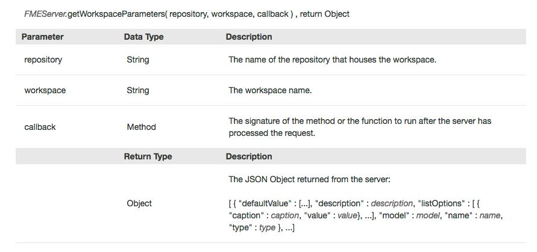
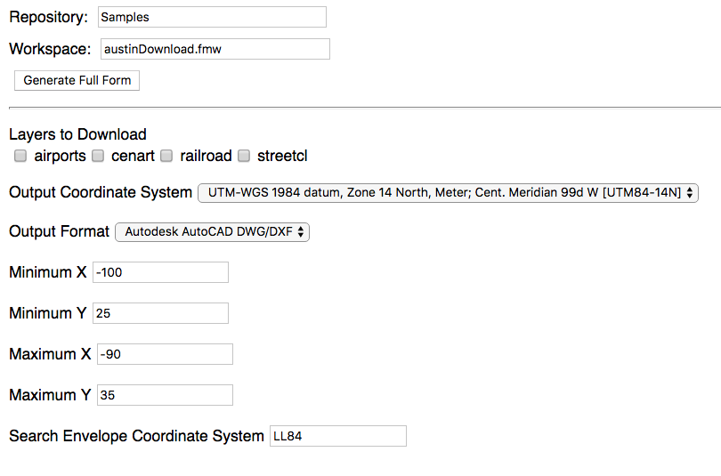

### Step 1. Create the Form

To create your HTML page you may use any text editor. A common text editor is
sublime text, which you can download here
[https://www.sublimetext.com/](https://www.sublimetext.com/).

Create a file and name it myFirstApp.html then enter in the following
code.

If you are using a training machine provided by Safe Software, open Notepad ++.  

    <head>

       <title>Populate Forms Dynamically Example from FME Server Developer Playground</title>

     <!-- Styles for example -->
     <link rel="stylesheet" href="https://playground.fmeserver.com/css/FMEServerExamples.css" type="text/css" />

     <!-- Include FMEServer.js -->
     

       <base target="_top">
      </head>

*2.1.1. The Head Section of the HTML*

In the head section of the page, we link to the external stylesheet and
the FME JavaScript Library.

Next, we will build the body of the HTML. We need to create a form that
will display the initial information needed to find the workspace.

In the body section paste:

    <body>

    <form id="exampleForm">
    		<label>Repository: </label>
    		<input id="repository-name" type="text" name="repository" value="Samples"/> 
    		<label>Workspace: </label>
    		<input id="workspace-name" type="text" name="workspace" value="austinDownload.fmw" />  
    		<input type="button" onclick="processForm();" value="Generate Full Form" />
    	</form>

    </body>

*2.1.2. The Example Form *

These two areas indicate that we have created a form that is referred to
as "exampleForm". If we needed the JavaScript to act upon the form this
is how we will refer to it by the id.

*2.1.3. The form items are created*

In the form we create a label and an input. The label is entitled
Repository: which will appear on the page. Then we need to give the
input an id so it can be called upon later. The input type is text, the
name is repository, and default value will be Samples.

We repeat the same input process for the workspace.

*2.1.4. A button is created for the form*

Now, we need an area to put the new form after it has been created. So we
have to create a blank form that will be modified by the JavaScript. This
will be inserted **inside the body** after the first form.

    

     <form id="output-form"></form>

In this section we will create the button which will be processed to
create the form with the parameters.

First let's test out our page! You can test your page by clicking on the HTML file. You should see this.

*2.1.5. The final form *

### Step 2. Add the Javascript to Populate the Form

Currently, we have a page with no functionality. So let's add in some
JavaScript.

Within the body we can add the script tag. This indicates that the next
section is in JavaScript. **All the Javascript will be within these
tags.**

      

First, we have to connect to the FME Server to retrieve the information
for the repository and the workspace.

    

*2.2.1. Connect to the Server *

You can update the server and token to yours, to gain access to your
server.

Next, we can insert the function processForm. This is activated when the
user clicks on the Generate Full Form button.

    // The process form function that gets the repository and the workspace
    		    function processForm() {
    			var repository = document.getElementById( "repository-name" ).value;
    			var workspace = document.getElementById( "workspace-name" ).value;

    			// Get the workspace parameters from FME Server
    			FMEServer.getWorkspaceParameters( repository, workspace, generateForm );
    		}

*2.2.2. Repository and Workspace are assigned*

In this section we are creating variables from the inputs we received
from the previous form.

*2.2.3. Get Workspace Parameters*

Then we use the function FMEServer.getWorkspaceParameters to get the
workspace parameters created in the call.

*2.2.4. Workspace Parameters Information*

Next, paste this section below the ProcessForm function.

    function generateForm( json ) {

    			// Build the form items using the API
    			FMEServer.generateFormItems( "output-form", json );
    }

This function has the following parameters:

*2.2.5. Generate Form Items Information*

The id is the "output-form" which is the id of a blank form created.

Time to test the script. Once you click, generate full form the output
produced should be:

*2.2.6. Final Output*

### Step 3. Add the Javascript to Run the Data Download

The next step is to add the script needed to process the selected area.

To do this we need to add in the following code:

    var form = document.getElementById( "output-form" );
                              // Create the Run Data Download Button
    var submitButton = document.createElement( "input" );
    submitButton.type = "button";
    submitButton.value = "Run Data Download";
    submitButton.setAttribute( "onclick", "runDataDownload();" );
    form.appendChild( submitButton );

*2.3.1. Get the output form variable *

In this section, we are creating a variable for the output form

*2.3.2. Create the Data Download Button*

In this section we are creating a button that once clicked will run the
Data Download.

    function runDataDownload() {
    var repository = document.getElementById( "repository-name" ).value;
    var workspace = document.getElementById( "workspace-name" ).value;
    var form = document.getElementById( "output-form" );
    var params = "";

    // Loop through unique parameters and build the parameter string
    for( var i = 0; i < form.length; i++ ){
    var element = form.elements[i];
    if( element.type == "select" ) {
    params += element.name+"="+element[element.selectedIndex].value+"&";
    } else if( element.type == "checkbox" ){
    if( element.checked ) {
        params += element.name+"="+element.value+"&";
    }
    } else {
    params += element.name+"="+element.value+"&";
    }
    }

    // Remove trailing & from string
    params = params.substr( 0, params.length - 1 );

    // Use the FME Server Data Download Service
    FMEServer.runDataDownload( repository, workspace, params, showResults );
    }

      function showResults( json ) {
    // The following is to write out the full return object
    // for visualization of the example
    var hr = document.createElement( "hr" );
    var div = document.createElement( "div" );

    // This extracts the download link to the clipped data
    var download = json.serviceResponse.url;

    div.innerHTML = "<h4>Return Object:</h4><pre>"+JSON.stringify(json, undefined, 4)+"</pre>";
    div.innerHTML += "
<a href=\""+download+"\">Download Result</a>";
    document.body.appendChild( hr );
    document.body.appendChild( div );
    }

The next two functions read the parameters and run the data download.

*2.3.3. Get the Variables from the first form*

In this section we are getting the variables that have been collected
from the first form. We are also creating a blank variable for the
parameters.

*2.3.4. Loop through the parameters*

In this section we are looping through the parameters to find their name
and value. We are doing this because the parameters have to be written
in this format for this function to work.

    Any workspace specific parameter values must be written as a string with this format:
    name1=value1&name2=value2 etc\...

*2.3.5. Create the Parameter String *

After the params has been complied there will be an additional ampersand
(&) at the end of the string. This is removed by the following
statement,

*2.3.6. Remove the trailing ampersand *

Finally, we can use the runDataDownload function.

*2.3.7. Run the Data Download Function*

*2.3.8. Data Download Information*

We named the callback showResults so we can create the showResults
function which will contain the return.

*2.3.9. Show Results*
