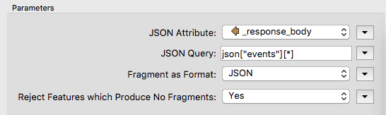
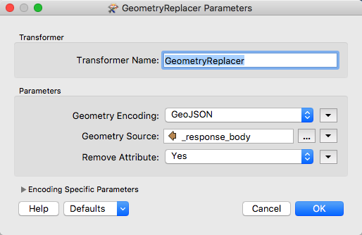

### Step 1. Create a copy of the first exercise and title it MySecondApp!

### Step 2. Add in the following code into the head of the HTML

    <!-- The following are Required for Google Maps Integration -->
    

### Step 3. Delete the Current Body and Replace with the Following

The following code is from the following demonstration
https://playground.fmeserver.com/javascript/job-submission/google-maps-submission/.
Later in the tutorial we will modify and build on this code to add
functionality to it.

    <body>
    	

    	
    </body>

*3.3.1. Onload Functions*

When the window is loaded, the map and the drawing tools are initialized
from google maps.

*3.3.2. Google Maps Geometry*

The above code creates events for every type of geometry and connects to
the FME Server.

*3.3.3. Google Maps Geometry Creation*

The above sections convert the objects from the Google API to Well Known
Text. If you are using these functions you probably will not need to
modify them. However, the next function can be modified to meet your
needs.

*3.3.4. Create the Geom Parameter*

Try this section first! Then we will modify it to bring in parameters
from an existing workspace.

### Step 4. Create a Workspace

Link to the completed workspace here

*3.4.1. Workspace Overview*

The first step is to get the user input from the web application. If you
look at this section of the code, you can see that we are setting that
the code is accepting a well known text string from the user input and
placing it in parameter called GEOM.

    var params = \"GEOM=\" + wktString;

So, to bring this information in the workspace we use the
GeometryReplacer. In the GeometryReplacer fill the parameters out below:

*3.4.2. Geometry Replacer*

The Geometry Encoding is Well Known Text from the Google Map. The
Geometry Source is a user parameter which will created. On the geometry
source click on the dropdown list, find the user parameter, then click
on Create User Parameter.

*3.4.3. Geometry User Parameter*

At this point in the workspace we have to coordinates into the system
and it has been converted to geometric features. However, there is no
way for FME for to know what the coordinate system is. So we are going
to set it to LL84.

*3.4.4. Drive BC API Workspace Overview*

**Add the HTTPCaller**

Next, we need to add the HTTPCaller to contact the Drive BC API. This
will be connected to the creator as well. The Drive BC API is open to
the public so no authorization or authentication is needed. Under
Request URL put:

    http://api.open511.gov.bc.ca/events?format=json&status=ACTIVE

The HTTP Method is GET

The HTTPCaller Parameters should look like this:

*3.4.5. HTTP Caller Parameter*

Currently, the workspace should look like this:

*3.4.6. Creator and HTTP Caller*

**Add JSONFragmenter**

The response body will be returned as a long section of JSON. We need to
break this down and expose the attributes needed. All the important
information is stored in the category of events so to gain access to it
under the JSON Query write:

    json\["events"\]\[\*\]

*3.4.7. JSON Fragmenter*

Now we can flatten the JSON to produce the attributes needed for the
table. In the Attributes to Expose Section list status, headline,
description, created, and updated.

The Flattening Parameters should look like this:

*3.4.8. JSON Flattener*

**Add another JSONFragmenter**

Now we need to expose the Geography component to create features.

*3.4.9. New JSON Fragmenter*

There are no Flattening Parameters in this transformer.

**Add a GeometryReplacer**

The GeometeryReplacer is an amazing transformer. It can read the JSON
from the Response Body and will automatically create the geometry
associated with it.

*3.4.10 Geometry Replacer*

Currently, the workspace should look like this:

*3.4.11 Drive BC Workspace*

**Add the CoordinateSystemSetter**

Now we need to set the coordinate system used. The coordinate system is
referenced in URL returned by the call. So we can set it to LL-WGS84
\[EPSG \#4326\].

*3.4.12 Clipper Transformer*

**Add the Clipper Transformer**

Now we are going to use the clipper transformer to clip the area
selected area. The clipper is the area selected by the user and the
clippee is the geometry from the BC Drive API.

**Add the Date Time Converter**

The Date Time Converter is used to update the time and date so it is
more readable for the user.

*3.4.13 Date Time Converter*

**Add the HTMLReportGenerator**

Now we are ready to create a webpage with the following information. We
need three sections, a title, a map, and a table.

The title is made with custom HTML

    <h1\> Drive BC Road and Weather Conditions </h1\>

*3.4.14 Custom HTML*

Next, you may add a Map Component. For this exercise, I used Google with
an API Key. I labeled the attribute with the description of the
condition.

*3.4.15 Custom Map*

Next, I created a table with the status, created, updated, description,
and headline columns.

*3.4.16 Custom Table*

**Add the HTML Writer**

Finally, add in the HTML writer to write to a file of your choice.

**Upload the Workspace to your Server.**

Upload the workspace under the Data Download, Data Streaming, and Job
Submitter services.

### Step 5. Modify the Code to Produce to Work With the New Workspace

**Add a Page Header to give context to the map**

Directly under the body tag we are going to add a title and instructions

      
 <h1> Traffic Accident Map </h1> 

      
 <h2> Click on the polygon icon and select an area.
      Once the area has been selected a link will appear with the download link.
      </h2>

**Change the zoom level and map center **

*3.5.1 Center and zoom*

**Comment Out The Unused Drawing Tools**

First change the drawing tool to polygon. Then comment out the polyline
and marker drawing tools.

*3.5.2 Drawing Tools*

**Comment Out the Listener Marker and Polyline Functions in the Code**

*3.5.3 Listener Functions*

**Update the Server Initialization To Include Your Server Information
and Token.**

*3.5.4 Server and Token*

Example formatting:

     server : "https://demos-safe-software.fmecloud.com",

     token : "568c604bc1f235bbe137c514e7c61a8436043070"   

**Comment Out the Create Well Known Text Functions For the Point and
Line Section**

*3.5.5 Comment out point and line sections*

**Convert the Polygon Object from the Google Maps API to Well Known Text**

Now we are going to create a link that the user can click to download
the data. We are going to do this be creating a new data streaming URL.

To find the correct format go to your Server and find the workspace you
just uploaded. For the area of interest use the following information:

        POLYGON
        ((-124.51243486475238 48.5396241359511,
        -124.86399736475238 50.25186902531769,
        -119.85972490381488 50.28347019024168))

This is how the information is relayed to the system currently. Then
open up the advanced drop down. Now click on the Direct URL Example and
see how that information is formatted.

*3.5.6 Direct URL Example*

Now we should modify the following code for the tutorial.

    //convert polygon object from Google Maps API to well known text
      		function createWKTPolygon(poly){
      			var wktString = 'POLYGON((';
      			//loop through coordinates and add them to string
      			for(var i=0; i<poly.getLength(); i++){
      				wktString += poly.getAt(i).lat() + ' ';
      				wktString += poly.getAt(i).lng() + ',';
      			}
      			//remove trailing , from string
      			wktString = wktString.substring(0,wktString.length - 1);
      			wktString += '))';
      			sendToWorkspace(wktString);
      		}

The first step is to switch the long and the lat information.

    convert polygon object from Google Maps API to well known text
    		function createWKTPolygon(poly){
    			var wktString = 'POLYGON((';
    			//loop through coordinates and add them to string
    			for(var i=0; i<poly.getLength(); i++){
    				wktString += poly.getAt(i).lng() + ' '; // <-- Update here
            wktString += poly.getAt(i).lat() + ','; // <-- Update here

    			}
    			//remove trailing , from string
    			wktString = wktString.substring(0,wktString.length - 1);
    			wktString += '))';
    			sendToWorkspace(wktString);
    		}

Next, we need we to modify the statement so after the lng %20 is placed
to demonstrate a space. Then the lat should have %2C is represent a
comma. Then the end string length should be reduced by three to
eliminate the last %2C from the statement. Finally instead of sending
the information to the sendToWorkspace function. We will send it to the
dataStreaming function.

    //convert polygon object from Google Maps API to well known text
    		function createWKTPolygon(poly){
    			var wktString = 'POLYGON((';
    			//loop through coordinates and add them to string
    			for(var i=0; i<poly.getLength(); i++){
            wktString += poly.getAt(i).lng() + '%20'; //<-- Update here
    				wktString += poly.getAt(i).lat() + '%2C'; // <-- Update here

    			}
    			//remove trailing , from string
    			wktString = wktString.substring(0,wktString.length - 3); //<-- Update Here
    			wktString += '))';
    			dataStreaming(wktString);
    		}

**Create a New Function To Make the Request URL and Download Link**

Delete the sendToWorkspace function and add the following code.

    function dataStreaming(wktString){

                var params = "GEOM=" + wktString;
                server = " YOUR SERVER URL  ";
                repository = " YOUR REPOSITORY NAME ";
                workspace = " YOUR WORKSPACE ";

                var hr = document.createElement( "hr" );
                var div = document.createElement( "div" );

                var resultUrl = server + "/fmedatastreaming/" + repository + "/" + workspace + "?" + params;

                div.innerHTML += ('<a href="' + resultUrl + '">' + 'Download Data </a>')
          document.body.appendChild( hr );
          document.body.appendChild( div );

          }

*3.5.7 Data Streaming*

This section sets up the URL with the variables needed from the server.

*3.5.8 Direct URL Variables*

This section creates a new line and div to separate the data download
button.

*3.5.9 Direct URL*

This section combines everything into a URL.

*3.5.10 Data Download Button*

Finally, the Data Download button is created.

If when you are testing your application you receive a login dialog like
the one below you will have to change the permission on the repository
to include guest access. To do this follow the instructions here: LINK
TO ABOVE. Anytime you are using a direct URL you will have to provide
the guest access to the repository.

*3.5.11 Sign In*
