### Step 1. Link to ArcGIS maps

In the head section place the following code:

    <head>

      <title>Data Streaming Service</title>
      <!-- The following are Required for ArcGIS Maps Integration -->
    <link rel="stylesheet" href="https://js.arcgis.com/3.8/js/esri/css/esri.css" />
    

      

      <base target="_top">

    </head>

### Step 2. Create the Workspaces and Upload Them to Your Server

To use this Data Streaming process we need to create workspaces that
produce a KML. As an example I produced four simple workspaces that
produce KML files. These can be downloaded here or you can create your
own.

Since we are working with multiple layers, it is best to use the KML
Styler Transformer.

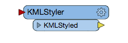

*4.2.0 KML Styler *

This allows the user to style a KML before it is created. Through this
transformer you can choose a custom point icon. Then, you select colours
for lines and polygons.

Additionally, you may want to use an online data source for your map
layers since they will be reactive to any changes in the data. An
example of this would be using food vendor data from the City of
Vancouver (http://data.vancouver.ca/datacatalogue/foodVendors.htm). If
you hover over a file a link to the data source will appear. This data
source can be used as a dataset within a workspace, so as the City of
Vancouver updates their files this will be reflected in the workspace.

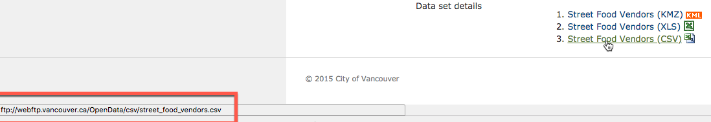

*4.2.1 CSV Link*

*Hover over the link to find the source of the CSV file*

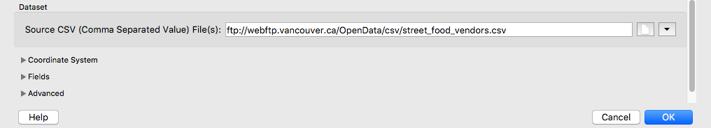

*4.2.2 Source Dataset*

*Use the link as a source for a dataset. *

### Step 3. Create the HTML Body

**Please note the rest of the code also belongs in the body tag.**

    <body>    
    
 <h1> Data Loading Example </h1> 

        

            <legend> Map Layers: </legend>

            <fieldset>

           <input type="checkbox" onclick="skytrainDirectURL();" name="Sky Train Stations" id="skytrain" />
            <label for="skytrain">Sky Train Stations</label>
             
            <input type="checkbox" onclick="bufferDirectURL();" name="Sky Train Buffer" id="buffer" />
            <label for="buffer">Sky Train Buffer</label>
             
            <input type="checkbox" onclick="parksDirectURL();" name="Parks" id="parks" />
            <label for="parks">Parks</label>
             

            <input type="checkbox" onclick="foodDirectURL();" name="food" id="food" />
            <label for="food">Food</label>
             

            </fieldset>

        

             

        

               

        

    </body>

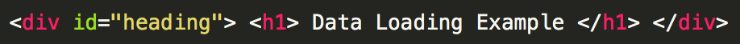

*4.3.0 Header*

This section of code creates the title for the Web App. It is wrapped in
the div heading which will be modified using CSS.

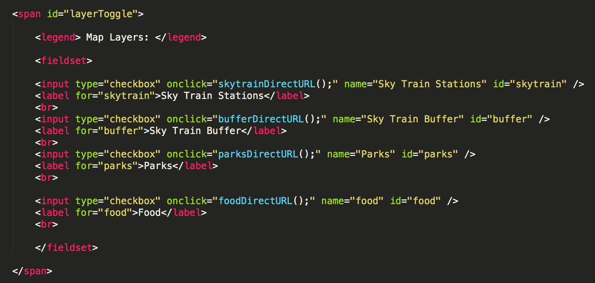

*4.3.1 Checkbox*

This is the HTML portion that creates the legend. It creates a checkbox
and a label which will control the map layers as they are toggled on and
off. Once the box is clicked, the onclick function will activate. The
label is connected to the checkbox to display what the label is for. The
span will be used for the CSS later in the tutorial.

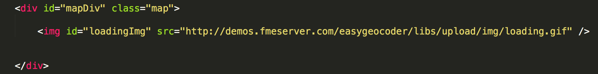

*4.3.2 GIF*

This section is where the map will reside. In this area the ESRI
Javascript will render the map. Beneath this, we have a loading image
which is really a GIF. This GIF is activated when the data is loading to
indicate to the user that the layer is loading. Once, the layer has
loaded the GIF is removed.

### Step 4. Create the Javascript Section

    

This section renders the map as the window loads. It also, contains the
functions to activate the loading function and remove it.

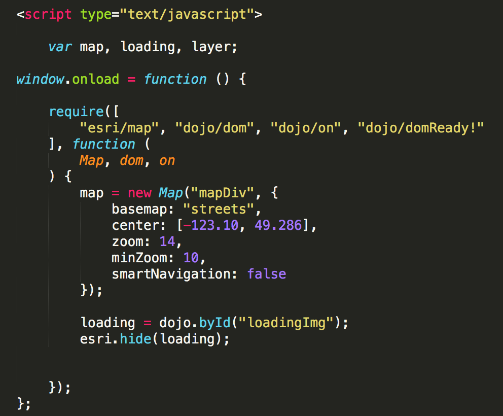

*4.4.1 Map Centering *

First, the variables: map, loading, and layer are created. Then, the
window onload function is activated.

This section pulls functions from the ESRI and Dojo Javascript Libraries
to prepare the map. Now all we have to do is edit the map variable
section to choose the basemap and center the map.

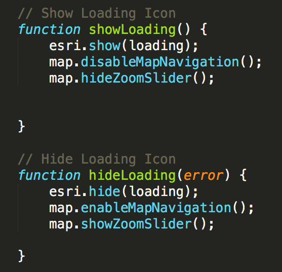

*4.4.2 Loading Functions*

The showLoading and hideLoading functions are from ESRI, as the layers
on the map loads, it will display the loading GIF. Our layers will be
displayed dynamically, therefore the layer is created once the workspace
for each layer is run. This could take a little longer for complex data
so we use the loading GIF to let the user know their request is being
processed.

The next step is to add the Javascript to add and remove each layer from
the map. This code belongs right after the hideLoading function inside
the script tag.

    function skytrainDirectURL() {
    	    var skytrain = document.getElementById("skytrain");
    	    if (skytrain.checked == true) {
    	        var workspace = "https://bluesky-safe-software.fmecloud.com/fmedatastreaming/Sienna/webapp.transit.fmw?";

	        loadData(workspace)

	        function loadData(workspace) {
	            require([
	                "esri/layers/KMLLayer", "dojo/parser"
	            ], function (
	                KMLLayer, parser
	            ) {

	                parser.parse();

	                // Create the ArcGIS Layer and display on the map
	                showLoading();
	                skytrainlayer = new KMLLayer(workspace);
	                map.addLayer(skytrainlayer, 1000);
	                skytrainlayer.on("load", function () {
	                    hideLoading();
	                });
	            });
	        }

	    } else {
	        map.removeLayer(skytrainlayer);
	    }
	}

	function bufferDirectURL() {
	    var buffer = document.getElementById("buffer");
	    if (buffer.checked == true) {
	        var workspace = "https://bluesky-safe-software.fmecloud.com/fmedatastreaming/Sienna/webapp.transit.buffer.fmw?";
	        loadData(workspace)

	        function loadData(workspace) {
	            require([
	                "esri/layers/KMLLayer", "dojo/parser"
	            ], function (
	                KMLLayer, parser
	            ) {

	                parser.parse();

	                // Create the ArcGIS Layer and display on the map
	                showLoading();
	                bufferlayer = new KMLLayer(workspace);
	                map.addLayer(bufferlayer, 1000);
	                bufferlayer.on("load", function () {
	                    hideLoading();
	                });
	            });
	        }

	    } else {
	        map.removeLayer(bufferlayer);
	    }
	}

	function parksDirectURL() {
	    var parks = document.getElementById("parks");
	    if (parks.checked == true) {
	        var workspace = "https://bluesky-safe-software.fmecloud.com/fmedatastreaming/Sienna/webapp.transit.parks.v2.fmw?SourceDataset_MITAB=%24(FME_SHAREDRESOURCE_DATA)%2FSienna%2FParks%2FParks.tab";
	        loadData(workspace)

	        function loadData(workspace) {
	            require([
	                "esri/layers/KMLLayer", "dojo/parser"
	            ], function (
	                KMLLayer, parser
	            ) {

	                parser.parse();

	                // Create the ArcGIS Layer and display on the map
	                showLoading();
	                parkslayer = new KMLLayer(workspace);
	                map.addLayer(parkslayer, 1000);
	                parkslayer.on("load", function () {
	                    hideLoading();
	                });
	            });
	        }

	    } else {
	        map.removeLayer(parkslayer);
	    }
	}

    function foodDirectURL() {
	    var food = document.getElementById("food");
	    if (food.checked == true) {
	        var workspace = "https://bluesky-safe-software.fmecloud.com/fmedatastreaming/Sienna/webapp.foodTrucks.fmw?DestDataset_OGCKML=%24(FME_SHAREDRESOURCE_DATA)%2FSienna%2FOutput%2FfoodTrucks.kml";
	        loadData(workspace)

	        function loadData(workspace) {
	            require([
	                "esri/layers/KMLLayer", "dojo/parser"
	            ], function (
	                KMLLayer, parser
	            ) {

	                parser.parse();

	                // Create the ArcGIS Layer and display on the map
	                showLoading();
	                foodlayer = new KMLLayer(workspace);
	                map.addLayer(foodlayer, 1000);
	                foodlayer.on("load", function () {
	                    hideLoading();
	                });
	            });
	        }

	    } else {
	        map.removeLayer(foodlayer);
	    }
	}

The code for each layer is almost identical so if you wanted to add more
layers to the map it would be quite easy. Let's go through what a single
layer is doing.

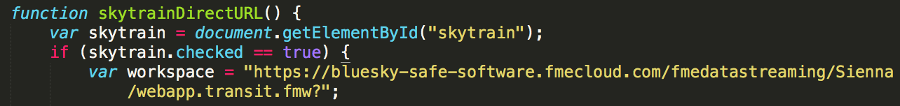

*4.4.3. Direct URL Function*

First, we get the layer by referencing the ID created in the checkbox
element. Then, if the skytrain box is checked it will will activate the
function to load the data. You will have to update your workspace here
by finding the Direct URL for data streaming. To find this open your
workspace in the server. Then, hit the drop down for the advanced
settings and find the Direct URL link. To make this process easier you
may want to set the parameters to private this way the URL is shorter.

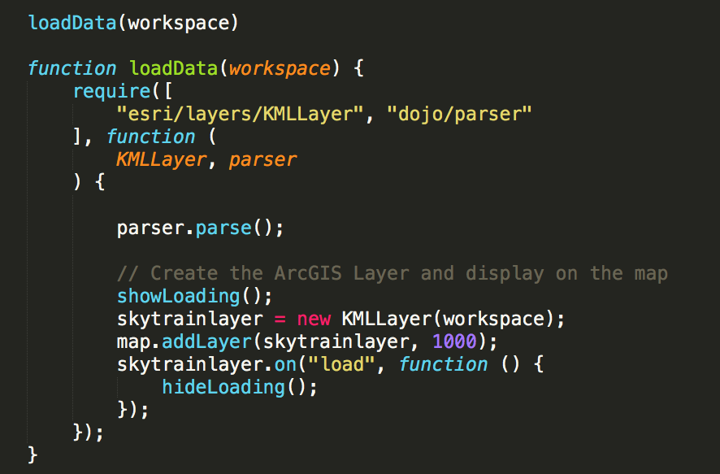

*4.4.4 Loading Data*

We already stated that the workspace is the variable that contains the
data streaming link. Then we use the loadData function from ESRI. First,
the showLoading function is activated to turn on the GIF to represent
the layer loading.

Then we create a variable, skytrainlayer which is the new KMLLayer that
was just added. This will be helpful once we need to remove the layer.
The skytrain layer is added and once it loads, the hideLoading function
is activated to remove the loading GIF.

Now, if the Skytrain checkbox is unchecked, we need a function to remove
the layer. In this case we use an else statement to remove a layer.

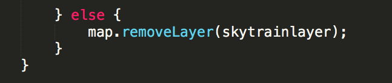

*4.4.5 Remove Layer*

This function is repeated for each layer, you just have to change each
name.

The data is loading dynamically which allows the user to see the most up
to date data. If there was a layer that updated frequently this would be
shown every time the user activates the layer.
