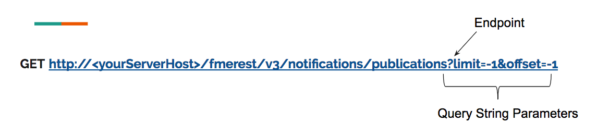

### 1.2 What Components are in a Request?

*Image 1.2.1 Diagram of the components in a request*

Before getting started it is important to know what an example request
to the server looks like. For a full list of example calls please visit
[https://docs.safe.com/fme/html/FME\_REST/apidoc/v3/\#](https://docs.safe.com/fme/html/FME_REST/apidoc/v3/#).

**HTTP Verb:**

HTTP Verbs are essential to every call to the REST API. **HTTP Verbs
represent an action to the FME Server that you would like to complete.**

<table>

<tr>
<th>HTTP Verb</th>
<th>Action</th>
<th>Uses in FME Server</th>
</tr>

<tr>
<td>POST</td>
<td>Create</td>
<td>Create a publication, project, notification.</td>
</tr>

<tr>
<td>GET</td>
<td>Read</td>
<td>Perform a health check, get information on the server, get notifications on the publication.</td>
</tr>

<tr>
<td>PUT</td>
<td>Update and Replace</td>
<td>Replace a publication, update a project, update user information
</td>
</tr>

<tr>
<td>DELETE</td>
<td>Delete</td>
<td>Delete topics, users, roles.</td>
</tr>

</table>

---

**Request URL**

**The Request URL is how you can make the call. It is composed of
keywords that indicate to the server what you are trying to do.** In
this tutorial, we will discuss the different requests you can make.
Each request will have the same base URL:

[http://YOURSERVER/fmerest/v3/](http://yourserver/fmerest/v3/)

Parameters influence the response of the REST API by specifying a
constraint on the call. There are two main parameters within the Request
URL.

**Path Parameter-** Path parameters are required by the call and act as
a part of the endpoint. The following call requires the name of the
publication to work. The publication name is My Sample Publication
because we cannot enter spaces in the URL %20 indicates the space.

*Image 1.2.2 Diagram representing the Path Parameter*

**Query String Parameters**- Query string parameters are specified after
the question mark in the endpoint in the Request URL.

*Image 1.2.3 Diagram representing the Query String Parameter*

In the above request URL, there are two parameters, the limit, and the
offset. The parameters are separated by the ampersand (&). The order
does not matter for the query string parameters so you may place the
offset before the limit and the request will produce the same result.

A request URL may contain both path parameters and query string
parameters.

**Request Header**

**REST Headers set the context for the type of call you are trying to
place. They provide the required information for the call to take
place.** To begin there are three main headers we will use.

1. **Authorization**: Almost every call to the FME Server requires
authorization. Authorization ensures that the call being placed to the
FME Server is made with permission. Authorization is given by a token.
To receive a token visit,
[http://*your.server.host*/fmetoken/](http://your.server.host/fmetoken/).
To learn more about authorization visit,
[http://docs.safe.com/fme/2017.1/html/FME\_Server\_Documentation/Content/AdminGuide/Configuring-Authentication-for-Security-Resources.htm](http://docs.safe.com/fme/2017.1/html/FME_Server_Documentation/Content/AdminGuide/Configuring-Authentication-for-Security-Resources.htm).

2. **Accept:** Accept dictates the language the of the response being
returned. This ensures the client is prepared for the response. During
this tutorial the accept will be application/json.

3. **Content-Type:** The content type tells the server what language the
request body is in. During this tutorial, we will use JSON,
x-www-form-urlencoded, and binary.

**Request Body**

The request body defines the parameters of what is being completed. It
specifies the information to be modified, created, or deleted. We will
provide examples later in the tutorial.

**Example Request**

The example below exports a project as a download and has a total of
four parameters. In the request URL, there is a path parameter after
projects. FME\_PROJECT\_TEST is the name of the project that will be
downloaded. The Query String Parameter (accept=contents) specifies the
content type. There are two form parameters found in the body of the
call. There is the excludeSensitiveInfo which determines if any
sensitive information will be returned in the downloaded package. There
is also export ProjectName which is where you can specify the name of
the project when it is exported.

*Image 1.2.4 Diagram representing the content of a call.*
