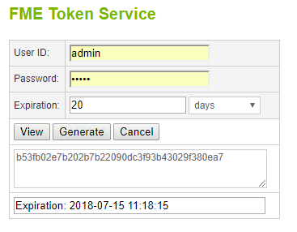
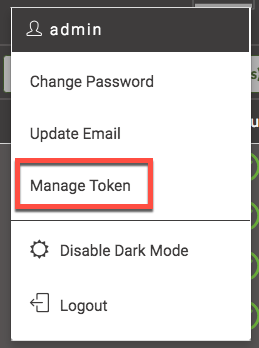
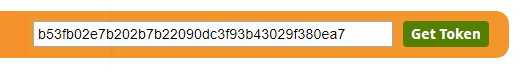

###  1.3 Authorization and Authentication

Security is always a very important consideration when working with any
online service. The REST API works with security in two ways:
authorization and authentication. **Authentication proves that the user is
who they say they are. Authorization verifies that the user is
authorized to make the call.**

Most calls to the FME Server require authorization. The REST API uses
tokens to prove the user is permitted to make the call to the server. A
token is a string of encrypted information that is sent between the
client and the server. Token Security will not be as secure as other
methods as the security of the system depends on controlling access to
the tokens.

#### Ways to get a token

There are many ways to get a token to use for authentication.

**1) Through the FME token page**

To generate a token visit:

          http://<yourServerHost>/fmetoken/
or http://localhost/fmetoken/ if you are using a training computer.

Once you access your server, you will be asked to verify your username
and your password and be asked to specify when you would like your token
to expire. The maximum amount of time you can issue a token for is two
years.

*Image 1.3.1 Token Service*

**2) Through your FME Server, http://localhost/fmeserver/#/home**

On the FME Server, click on the user icon. Then click Manage Token.

*Image 1.3.2 Manage Token*

*Image 1.3.3 How to find your token through the Server Interface*

**3) Through the REST API Homepage, http://localhost/fmerest/apidoc/v3/**

On the top right hand corner of the page you will see a green button that say Green Button that say "Get Token". Click here, to get a token or look up your existing token.

*Image 1.3.4 Get Token*

#### Tokens and Users

You may also request and manage tokens through the web application.
Often users will hard code the Guest User into the application. This
prevents the user from having to log in to access the data. The methods
of this will be discussed in a later tutorial on building a web
application.

#### Using a Token in a Call

There are two methods of including a token to the FME Server. You may
include the token in the query parameter and the authorization header. The actual methods of using these different practices will
be discussed later in the tutorial. However, for now, it's important to
know the pros and cons of each method.

**Query Parameter-** You may include the token right in the Request URL
of the call. This is a quick and easy way to use a call that requires a
token.

    http://<yourServerHost>/fmerest/v3/info?fmetoken=<yourToken>

However, this is not recommended because the token will be visible in
the URL.

**Authorization Header-** You may also include the token in the Request
Header. This is preferred method because the token will be more hidden
inside the call.

**Troubleshooting Authorization Errors**

If a call is not authorized you will receive an error code back from the
system. You may receive a Forbidden or Unauthorized message. Forbidden
(code 403) means the request was understood but refused. This indicates
you do not have the correct permissions to complete the request.
Unauthorized (code 401) indicates the credentials were missing or
incorrect. This may occur if the request needs a token and it is not
present, or the token is expired.
