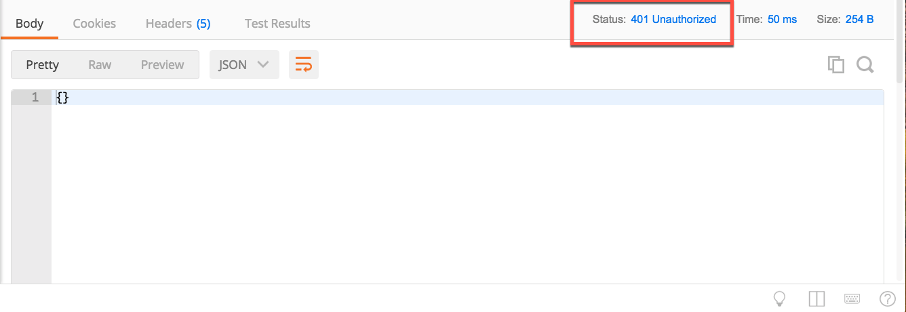

### Exercise 3.2 Authorization and the REST API

<table style="border-spacing: 0px;border-collapse: collapse;font-family:serif">
<tr>
<td width=25% style="vertical-align:middle;background-color:darkorange;border: 2px solid darkorange">
<i class="fa fa-cogs fa-lg fa-pull-left fa-fw" style="color:white;padding-right: 12px;vertical-align:text-top"></i>
Exercise 2
</td>
<td style="border: 2px solid darkorange;background-color:darkorange;color:white">
Authorization and the REST API
</td>
</tr>

<tr>
<td style="border: 1px solid darkorange; font-weight: bold">Data</td>
<td style="border: 1px solid darkorange">None</td>
</tr>

<tr>
<td style="border: 1px solid darkorange; font-weight: bold">Overall Goal</td>
<td style="border: 1px solid darkorange">To show how to properly authorize a call in the REST API</td>
</tr>

<tr>
<td style="border: 1px solid darkorange; font-weight: bold">Demonstrates</td>
<td style="border: 1px solid darkorange">The info call</td>
</tr>

</table>

This shows how to create an authorized call in the FME Server REST API. Authorization is an essential component in the REST API. Most calls do require authorization as a way to verify that the user may access information from the server. Authorization in the FME Server REST API is handled with tokens. This will be demonstrated and further explained below.

 

**1) Create the Call Below**

    GET http://<yourServerHost>/fmerest/v3/info

*This call will require a token. This next part of the
demonstration will show you what happens when you make an unauthorized
call to the server.*

*Image 3.2.1 Unauthorized call in Postman*

You should receive a message that says 401 Unauthorized. This is because
we have not used a token to authorize the call. The
next part of the guide will go over how to make a request on the server
using a token.

**2) Get A Token**

  There are many ways to get a token in the FME Server. The first way is to go to FME Server web interface. The right hand corner features a user symbol. That's the user settings, then go to manage token.  

  

  *Image 3.2.2 Get a token*

  Another way to get a token is by visiting,      

      http://<yourServerHost>/fmetoken.

**3) Use the Token in a Call**

  Now that we have a token we may use it in the request. Next to "GET"
paste the following URL into Postman. Replace "YOURTOKEN" with the token
you have received from the server.

    GET http://<yourServerHost>/fmerest/v3/info?fmetoken=YOURTOKEN

You should receive the 200 response code from the FME Server. Please
note this is not the preferred method of authorization. By putting the
token into the URL it is visible and will be less secure.

The preferred method is to use the Authorization Header. To find where
to place the Authorization Header, look underneath the URL find the
Headers section. In here, under key write Authorization. Then set the
value to Fmetoken token=your token. The URL should be

    http://<yourServerHost>/fmerest/v3/info

Now try running the call.

*Image 3.2.3 Using a token in Postman*

**4) Review the Response**

Once you click Send, you will see this response in Postman. This call returns the build and version. 

*Image 3.2.4 The response in Postman*

In this section, we went through the basics of making an authorized call to the FME
Server.
