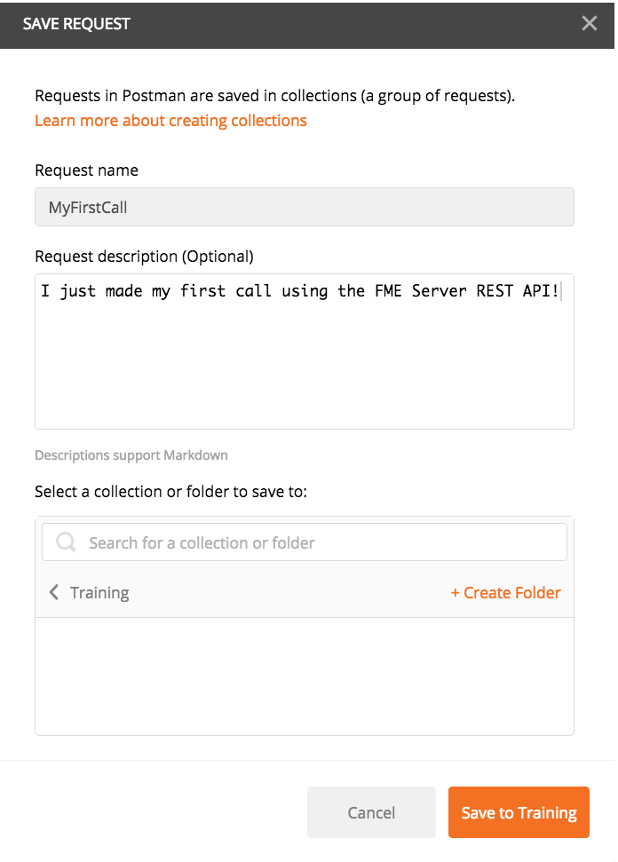
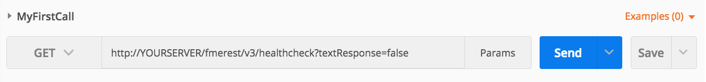

### 3.2 Making an HTTP Request Using Postman

Now we can make the call below using Postman.

    GET http://YOURSERVER/fmerest/v3/healthcheck?textResponse=false

This call requires no authorization and should run immediately. Notice
that there is a string query parameter in this call. This call will
automatically return a JSON response, however, you may override this by
setting the text response to true. This will return a text response
instead of JSON.

Welcome to Postman! We are now ready to make our first call to your FME
Server using the URL above. Once you open Postman you should see this
page. Click on Request.

*Image 3.2.1 Postman Interface*

From here, we receive a page to save our request. This is used if you
would like to save the call to use it in the future. Typically, the name
of the call would be much more descriptive. However, for the purposes of
this demonstration, you can come up with something creative. For this
call, you can create a new folder for training purposes.

*Image 3.2.2 Saving A Request in Postman*

Copy the URL into the toolbar and hit send! Notice, we are using the GET
HTTP Verb for this call. To understand what this verb means please
review the table above. Link to Table

*Image 3.2.3 Sending A Request in Postman*
