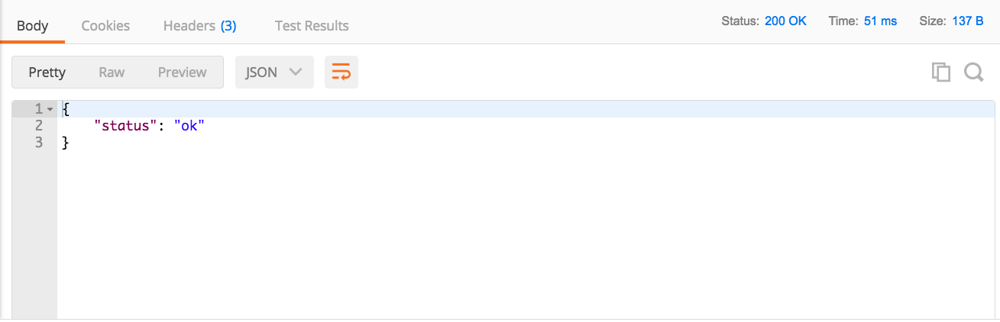

### 3.3 Interpreting the Response from Postman

Review your call. This is the response you receive.

*Image 3.3.1 Response from Postman*

Click the Headers section to see a more detailed view of the call

*Image 3.3.2 Response header in Postman*

Important Notes:

-   The response is in JSON. This is found in the header Response Header
    Content-Type.

-   In the top right-hand corner, you should see Status: 200 OK. This
    indicates it has successfully interacted with the server. This
    call required no authorization. However, most calls to the server
    do require authorization. The next step will be to make a call
    that does require authorization from the server.
