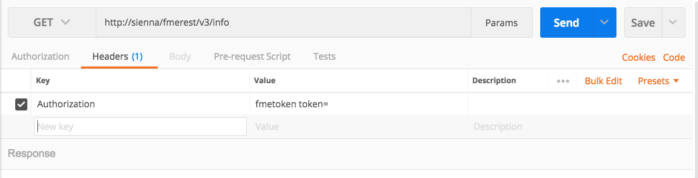

### 3.3 Creating a call with a token

Now that we have a token we may use it in the request. Next to "GET"
paste the following URL into Postman. Replace "YOURTOKEN" with the token
you have received from the server.

    GET http://YOURSERVER/fmerest/v3/info?fmetoken=YOURTOKEN

You should receive the 200 response code from the FME Server. Please
note this is not the preferred method of authorization. By putting the
token into the URL it is visible and will be less secure.

The preferred method is to use the Authorization Header. To find where
to place the Authorization header, look underneath the URL find the
Headers section. In here, under key write Authorization. Then set the
value to Fmetoken token= YOUR TOKEN. The URL should be
[http://YOURSERVER/fmerest/v3/info](http://sienna/fmerest/v3/info?fmetoken=e411779b3050ad777bab6f45f07d2ff5d02fbeb3).
Now try running the call.

*Image 3.5.1 Using a token in Postman*

In this section, we went through the basics of making a call to the FME
Server using Postman.
