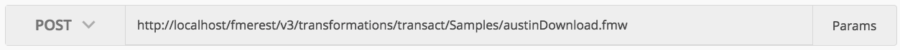

### 4.1 Exercise Running a Synchronous Job With Standard Parameters

<table style="border-spacing: 0px;border-collapse: collapse;font-family:serif">
<tr>
<td width=25% style="vertical-align:middle;background-color:darkorange;border: 2px solid darkorange">
<i class="fa fa-cogs fa-lg fa-pull-left fa-fw" style="color:white;padding-right: 12px;vertical-align:text-top"></i>
Exercise 3
</td>
<td style="border: 2px solid darkorange;background-color:darkorange;color:white">
Running a Synchronous Job With Standard Parameters
</td>
</tr>

<tr>
<td style="border: 1px solid darkorange; font-weight: bold">Data</td>
<td style="border: 1px solid darkorange">None</td>
</tr>

<tr>
<td style="border: 1px solid darkorange; font-weight: bold">Overall Goal</td>
<td style="border: 1px solid darkorange">To run a job synchronously using the FME REST API</td>
</tr>

<tr>
<td style="border: 1px solid darkorange; font-weight: bold">Demonstrates</td>
<td style="border: 1px solid darkorange">The Transact call</td>
</tr>

<tr>
<td style="border: 1px solid darkorange; font-weight: bold">Start Workspace</td>
<td style="border: 1px solid darkorange">None </td>
</tr>

<tr>
<td style="border: 1px solid darkorange; font-weight: bold">End Workspace</td>
<td style="border: 1px solid darkorange">None</td>
</tr>

</table>

This exercise demonstrates the transact call, which is used to run a job synchronously on the FME Server. 

An example of running a job synchronously would be:

**Please note that all calls in this section will require authorization. If you are not using a training machine please enter your server name instead of localhost**

    POST http://localhost/fmerest/v3/transformations/transact/Samples/austinDownload.fmw

Notice the **transact** this indicates to the Server that you will wait
until the process is complete before receiving a result. In Postman you
will need to set up the headers section and the URL as well. Here is how
you would set up this call in Postman.

**1) Enter in the URL**

The first step is to add in the URL. Paste the URL, in the top grey area that says "Enter request URL". Then set the drop down section from *GET* to *POST*.

*Image 4.1.1 Transact Call URL in Postman*

**2) Enter in the Headers**

    Headers:
      Content-Type: application/json
      Accept: application/json
      Authorization: fmetoken token= [INSERT TOKEN HERE]

To enter in the headers required for this call. Click on the Headers tag as demonstrated below.  

*Image 4.1.2 Transact Call Headers in Postman*

**3) Enter in the Body**

In this call we have a request body, that will be in JSON. This is
displayed in the Content-Type section. Additionally, we are requesting
JSON back which is under Accept = application/JSON. The Authorization is
where you would enter your token.

Next, we need to enter the body of the call. Click on the body section
of the call and click on the raw button and paste in the body provided.

    Body:
     {
      "publishedParameters": [
     {
       "name": "MAXY",
       "value": "42"
     },
     {
       "name": "THEMES",
       "value": [
         "airports",
         "cenart"
       ]
     }
     ],
     "TMDirectives": {
     "rtc": false,
     "ttc": 60,
     "description": "This is my description",
     "tag": "linux",
     "priority": 5,
     "ttl": 60
     },
     "NMDirectives": {
     "directives": [
       {
         "name": "email_to",
         "value": "example@safe.com"
       }
     ],
     "successTopics": [
       "SAMPLE_TOPIC"
     ],
     "failureTopics": []
     }
     }`

*Image 4.1.3 Transact Call Body in Postman*

**5) Click Send**

Click Send! Now, wait until the call is returned and you will receive a
message like this.

*Image 4.1.4 Transact Call Response in Postman*
