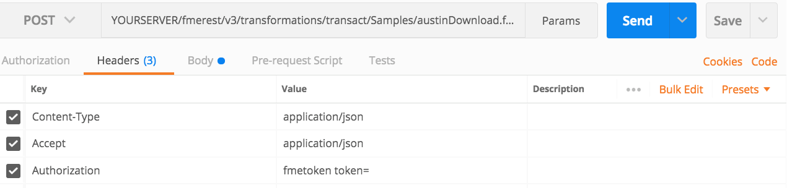
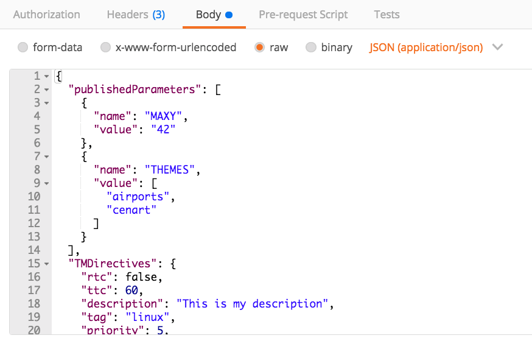

### 4.1 Running a Synchronous Job With Standard Parameters

An example of running a job synchronously would be:

    POST https://YOURSERVER/fmerest/v3/transformations/transact/Samples/austinDownload.fmw

    Headers:
    Content-Type: application/json
    Accept: application/json
    Authorization: fmetoken token= [INSERT TOKEN HERE]

    Body
    {
     "publishedParameters": [
    {
      "name": "MAXY",
      "value": "42"
    },
    {
      "name": "THEMES",
      "value": [
        "airports",
        "cenart"
      ]
    }
    ],
    "TMDirectives": {
    "rtc": false,
    "ttc": 60,
    "description": "This is my description",
    "tag": "linux",
    "priority": 5,
    "ttl": 60
    },
    "NMDirectives": {
    "directives": [
      {
        "name": "email_to",
        "value": "example@safe.com"
      }
    ],
    "successTopics": [
      "SAMPLE_TOPIC"
    ],
    "failureTopics": []
    }
    }

Notice the **transact** this indicates to the Server that you will wait
until the process is complete before receiving a result. In Postman you
will need to set up the headers section and the URL as well. Here is how
you would set up this call in Postman.

*Image 4.1.1 Transact Call Headers in Postman*

In this call we have a request body, that will be in JSON. This is
displayed in the Content-Type section. Additionally, we are requesting
JSON back which is under Accept = application/JSON. The Authorization is
where you would enter your token.

Next, we need to enter the body of the call. Click on the body section
of the call and click on the raw button and paste in the body provided.

*Image 4.1.2 Transact Call Body in Postman*

Click Send! Now, wait until the call is returned and you will receive a
message like this.

*Image 4.1.3 Transact Call Response in Postman*
