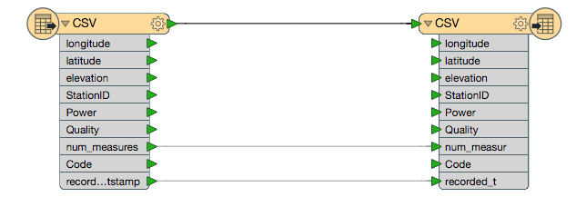
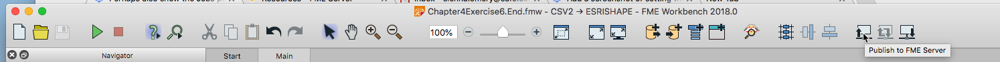
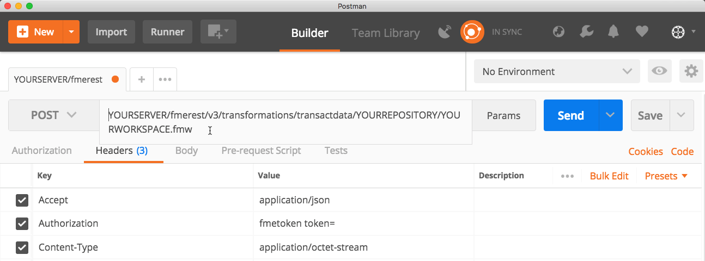

### 4.4 Running a Job Synchronously while Uploading Data. The Transact Data Call.

<table style="border-spacing: 0px;border-collapse: collapse;font-family:serif">
<tr>
<td width=25% style="vertical-align:middle;background-color:darkorange;border: 2px solid darkorange">
<i class="fa fa-cogs fa-lg fa-pull-left fa-fw" style="color:white;padding-right: 12px;vertical-align:text-top"></i>
Exercise 6
</td>
<td style="border: 2px solid darkorange;background-color:darkorange;color:white">
Running a Job Synchronously while Uploading Data. The Transact Data Call
</td>
</tr>

<tr>
<td style="border: 1px solid darkorange; font-weight: bold">Data</td>
<td style="border: 1px solid darkorange">None</td>
</tr>

<tr>
<td style="border: 1px solid darkorange; font-weight: bold">Overall Goal</td>
<td style="border: 1px solid darkorange">To use the REST API to receive information about a completed job. </td>
</tr>

<tr>
<td style="border: 1px solid darkorange; font-weight: bold">Demonstrates</td>
<td style="border: 1px solid darkorange">How to use the jobs call</td>
</tr>
<tr>
<td style="border: 1px solid darkorange; font-weight: bold">Starting Workspace</td>
<td style="border: 1px solid darkorange">Chapter4Exercise6.Start</td>
</tr>
<td style="border: 1px solid darkorange; font-weight: bold">Ending Workspace</td>
<td style="border: 1px solid darkorange">Chapter4Exercise6.End</td>
</tr>

</table>

The Transact Data call works by uploading data and running a workspace with one call to the server. It will simply run the workspace as it is and write the output to the location specified in the writer. That's good for inserting new data to a database. Once the call is completed the FME Server will return a 200 OK message. This indicates that the call was submitted successfully. However, it will not provide feedback on whether the job was completed successfully on the FME Server. It is recommended to periodically check the server to ensure your jobs are running successfully on the FME Server. Getting the status of jobs can be accomplished through the REST API as well. These calls will be displayed in Chapter 8.       

Let's start by creating a workspace that is compatible with the Transact Data call.

**1) Open the Chapter4Exercise6.Start Workspace**

 *** Include Exact Location***

 This is a very simple workspace that reads a CSV File and produces a Shapefile.  

 

 *Image 4.4.1 Starting Workspace*

However, there is one important change that is required for this translation to work in this call. The CSV has to be an optional parameter. This is because the data will be sent in the body of the POST request to the URL and not by setting the path to the source dataset parameter in the workspace. The source dataset parameter will need to be left unset for this to work, so we need to make it optional to prevent the workspace from throwing an error about this.

**2) Set the Source Dataset Published Parameter to Optional**

This is done by right-clicking on the published parameters and selecting Edit Definition.

*Image 4.4.2 Edit a Definition of a Published Parameter*

Then select the optional setting in the within the parameter settings.

*Image 4.4.3 Create an Optional Published Parameter*

**3) Create a folder in your FME Server for your output**

First, go to your FME Server. On the right hand side of the page locate the "Resources" and click on it. Next, click on Data. Finally, click on Create Folder and entitle it:

    RESTAPITraining

**4) Update the Shapefile destination to a Shared Resource File in your FME Server**

Next, change the Shapefile to a destination within your FME Server.

To do this right click the DestDataset published parameter, then click Edit Value. Then, insert a file path to your shared resources.   

    $(FME_SHAREDRESOURCE_DATA)/RESTAPITraining

**5) Upload the Workspace to the FME Server**

Now, it's time to upload the workspace to your FME Server. On the top right hand corner find the Publish to FME Server button and click it.

*Image 4.4.4 Upload the Workspace*

***ADD PHOTOS***

**6) Use Postman to complete the Transact Data Call**

*Please note that this call requires authorization*

The call is:

    POST    http://localhost/fmerest/v3/transformations/transactdata/YOURREPOSITORY/YOURWORKSPACE.fmw

In Postman set up the call with the following parameters.

*Image 4.4.4 Setting Up the Call in Postman*

The body of the call of the call will consist of the file to be
uploaded. Click on the body tab and then the binary button. This will
give you an option to upload a file, select this file you would like to
upload and run the call.

*Image 4.4.5 Uploading a File Postman*

You should receive a message 200 OK this indicates the call has
completed. You will not receive a file in return so you will have to
manually inspect the file. Web applications often want a zip file of the
data produced from a call and for that you will need a Direct URL which
will be examined in the next section.
