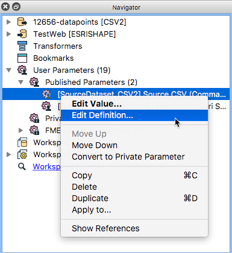
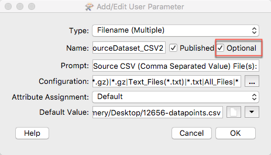
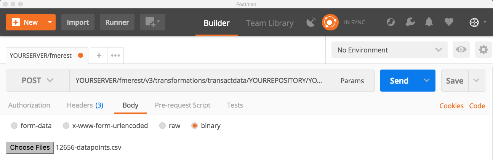

### 4.4 Running a Job Synchronously and Upload Data- Transact data

The Transact Data call works by uploading data and running a workspace
with one call to the server. This call is best used to add data to a
database, this is because the call will only return the 200 OK message.
While this indicates a successful call, it is not descriptive of the
results. This call will also not work with the Data Download Service.
This is because it is only compatible with the Direct URL. More
information on the Direct URL can be found in the next section of the
tutorial

Let's start by creating a workspace that is compatible with the Transact
Data call.

To complete this exercise, I followed the CSV to Shapefile outlined in
this tutorial.

[https://knowledge.safe.com/content/kbentry/1493/index.html](https://knowledge.safe.com/content/kbentry/1493/index.html)

However, there is one important change that is required for this
translation to work in this call. The CSV has to be an optional
parameter. This is because the body of the call is the data and needs to
be optional because the call will not recognize the file. This is done
by right-clicking on the published parameters and selecting Edit
Definition.

*Image 4.4.1 Edit a Definition of a Published Parameter*

Then select the optional setting in the within the parameter settings.

*Image 4.4.2 Create an Optional Published Parameter*

I changed the destination of the output shapefile to a folder in my FME
Server Shared Resources. Then, I uploaded the file to my FME Server
under the Job Submitter service.

From here you can use the call to upload data to send to the shapefile.

**Please note that all calls in this section will require
authorization.**

The call is:

    POST    http://YOURSERVER/fmerest/v3/transformations/transactdata/YOURREPOSITORY/YOURWORKSPACE.fmw

In Postman set up the call with the following parameters.

*Image 4.4.3 Setting Up the Call in Postman*

The body of the call of the call will consist of the file to be
uploaded. Click on the body tab and then the binary button. This will
give you an option to upload a file, select this file you would like to
upload and run the call.

*Image 4.4.4 Uploading a File Postman*

You should receive a message 200 OK this indicates the call has
completed. You will not receive a file in return so you will have to
manually inspect the file. Web applications often want a zip file of the
data produced from a call and for that you will need a Direct URL which
will be examined in the next section.
