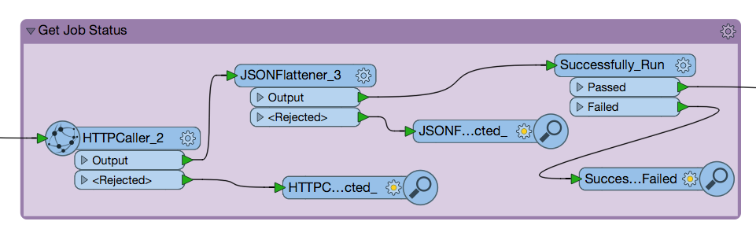
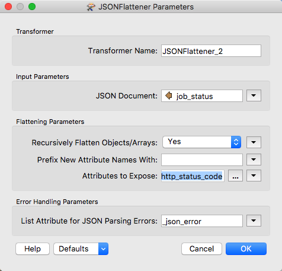

### 4.5 Using REST API Commands in a Workspace Exercise

You can use the calls you learned in this tutorial in a workspace
created. With each call you can format a new call within the REST API.
This is an excellent way to work with the REST API without any coding
experience.

There are some transformers you should be aware of before we get
started.

#### Creator

*Image 4.5.1 Creator Transformer*

The Creator is an excellent tool for testing a workspace. It will
trigger the workspace without the need to add data.

#### HTTP Caller

*Image 4.5.2 HTTP Caller Transformer*

The HTTPCaller is used to connect to REST APIs. It separates the call
into categories similarly to Postman. Simply enter in the Request URL,
HTTP Method, Query String Parameters, Header, and Body. The body is
broken down into several parts. You can upload data, or write the body
of the call as we have before.

#### JSON Flattener

*Image 4.5.3 JSON Flattener Transformer*

The JSONFlattener takes the JSON responses from the FME Server and can
break down the components so they can easily be used for future calls to
the server.

#### Attribute Keeper

*Image 4.5.4 Attribute Keeper Transformer*

The HTTP Caller will produce attributes that you may use in your calls.
However, you may only wish to keep one. The Attribute Keeper acts as a
filter, it will only keep the attributes you specify.

A very simple workspace you can create would be one that triggers
multiple workspaces in the FME Server. In this workspace, we are going
to step up a workspace to run asynchronously, wait for a response, if
the response is positive the next workspace will run. So let's begin!

*Image 4.5.5 First Step **

Step 1. Start the workspace and run a call asynchronously.

-   First, add the creator to the page. Keeping the default is okay,
  this will just trigger the workspace to run.

-   Next, add the HTTPCaller. Use the Request URL to write a submit
  command. You may use the call below or test it out with another
    workspace.

-   In the HTTPCaller, you can use the token, or use the
      authentication option. Simply, enter your username and
      password into the user authentication area.

      POST https://YOURSERVER/fmerest/v3/transformations/submit/Samples/austinDownload.fmw
      Headers:
            Accept: application/json
            Authorization: fmetoken token=YOUR TOKEN

      Body: {
        "publishedParameters": [
          {
            "name": "MAXY",
            "value": "42"
          },
          {
            "name": "THEMES",
            "value": [
              "airports",
              "cenart"
            ]
          }
        ],
        "TMDirectives": {
          "rtc": false,
          "ttc": 60,
          "description": "This is my description",
          "tag": "linux",
          "priority": 5,
          "ttl": 60
        },
        "NMDirectives": {
          "directives": [
            {
              "name": "email_to",
              "value": "example@safe.com"
            }
          ],
          "successTopics": [
            "SAMPLE_TOPIC"
          ],
          "failureTopics": []
        }
      }

When you insert the body section of the call find **Upload Body** and
click on the dropdown menu. Click on open text editor and paste the
upload body into the call. Next, find the **Content Type** section and
specify JSON (application/json). The body should look like this:

*Image 4.5.6 Upload Body*

-   Now you can add the JSONFlattener. The JSONFlattener allows you to
    select a part of the JSON to expose, in our case we should expose
    the id, so we can use it for the next call.

*Image 4.5.7 JSON Flattener Parameters*

Step 2. Get Job Status

*Image 4.5.8 Step 2. **

-   In this section, we are using the response from the previous call to
    determine if the call was successfully run. We will add a
    **HTTPCaller.** In the HTTPCaller, click on the drop-down menu
    next to the Request URL and click open Text Editor. Paste the
    request and for the id double-click on this icon
     from the FME Feature Attributes
    side panel. Your call should look like this:

    GET http://YOURSERVER/fmerest/v3/transformations/jobs/id/@Value(id)

-   Now for the response in the HTTPCaller, we are going to change the
    Response Body Attribute to job\_status. So your HTTPCaller should
    look like this:

*Image 4.5.9 HTTP Caller Parameters*

-   Next, we need another **JSON Flattener** to expose the
    \_http\_status\_code from the job\_status attribute. So, for the
    input parameters under JSON Document, we are going to select
    job\_status. Then under attributes to expose write
    \_http\_status\_code.

*Image 4.5.10 Second JSON Flattener Parameters*

-   Now we are going to add a **Tester** to determine if the workspace
    was successfully run. The tester should be set up like this:

*Image 4.5.11 Tester Parameters*

-   If the HTTP status code is 200 then the call was successful and the
    next workspace will be triggered.

Step 3. New Job is Run

-   Finally, I used a third HTTPCaller to run a new job synchronously.
    To do this I used the same call that is
    [here](#running-a-synchronous-job-with-standard-parameters).

*Image 4.5.12 Final HTTP Caller*

While this is not the most practical example because we are running the
same workspace twice but in two different ways, it demonstrates how FME
can be used. It demonstrates the capabilities of running one workspace
and using the response to determine the next action.
