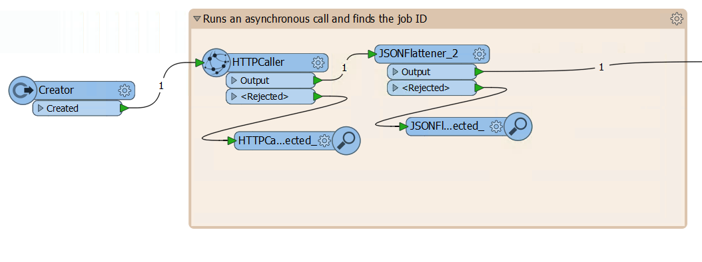
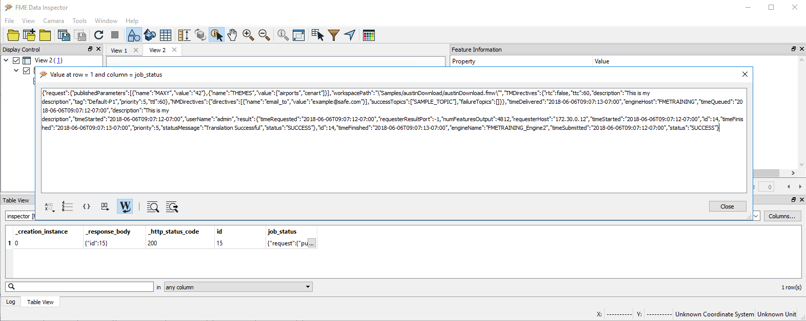

### 4.6 Chaining Jobs Together using the REST API in FME Workbench

<table style="border-spacing: 0px;border-collapse: collapse;font-family:serif">
<tr>
<td width=25% style="vertical-align:middle;background-color:darkorange;border: 2px solid darkorChaange">
<i class="fa fa-cogs fa-lg fa-pull-left fa-fw" style="color:white;padding-right: 12px;vertical-align:text-top"></i>
Exercise 7 
</td>
<td style="border: 2px solid darkorange;background-color:darkorange;color:white">
Using REST API Commands in a Workspace Exercise
</td>
</tr>

<tr>
<td style="border: 1px solid darkorange; font-weight: bold">Data</td>
<td style="border: 1px solid darkorange">None</td>
</tr>

<tr>
<td style="border: 1px solid darkorange; font-weight: bold">Overall Goal</td>
<td style="border: 1px solid darkorange"> To use the REST API in a workspace </td>
</tr>

<tr>
<td style="border: 1px solid darkorange; font-weight: bold">Demonstrates</td>
<td style="border: 1px solid darkorange">How to use the HTTP Caller to access the FME Server</td>
</tr>
<tr>
<td style="border: 1px solid darkorange; font-weight: bold">Starting Workspace</td>
<td style="border: 1px solid darkorange">None</td>
</tr>
<td style="border: 1px solid darkorange; font-weight: bold">Ending Workspace</td>
<td style="border: 1px solid darkorange">C:\FMEData2018\Workspaces\RESTAPITraining\Chapter4Exercise7.Complete</td>
</tr>

</table>

A very simple workspace you can create would be one that triggers
multiple workspaces in the FME Server. In this workspace, we are going
to step up a workspace to run asynchronously, wait for a response, if
the response is positive the next workspace will run. So let's begin!

*Image 4.6.1 Create a call to run asynchronously*

**1) Create a new workspace in Workbench**

**2) Add a Creator Transformer to the Page**  
First, add the creator to the page. Keeping the default settings are okay, this will just trigger the workspace to run.

**3) Add an HTTPCaller to the Page**  
Next, add the HTTPCaller. Use the Request URL to write a submit command. You may use the call below or test it out with another workspace.

There are a few different ways to authenticate with FME Server in the HTTPCaller:

1 - Use the token in the URL or header  
2 - Check use authentication and set to basic authentication and enter your username and password  
3 - Check use authentication and set up an FME Server Web Connection

**Please note that all calls in this section will require authorization.**

The first sections in the HTTPCaller to fill out is the Request and Headers. The layout in the HTTPCaller is very simple because all the areas to fill are clearly labelled.

Please note this is an example call which can be found here:      

https://docs.safe.com/fme/html/FME_REST/apidoc/v3/index.html#!/transformations/submit_post_22

 First, paste the Request URL in. Then, change the HTTP Method to Post. Update the Headers.

    POST http://<yourServerHost>/fmerest/v3/transformations/submit/Samples/austinDownload.fmw
    Headers:
          Accept: application/json
          Authorization: fmetoken token=<yourToken>

*Image 4.6.2 Header and URL*

When you insert the body section of the call find **Upload Body** and
click on the dropdown menu. Click on open text editor and paste the upload body into the call.

         {
          "publishedParameters": [
            {
              "name": "MAXY",
              "value": "42"
            },
            {
              "name": "THEMES",
              "value": [
                "airports",
                "cenart"
              ]
            }
          ],
          "TMDirectives": {
            "rtc": false,
            "ttc": 60,
            "description": "This is my description",
            "tag": "linux",
            "priority": 5,
            "ttl": 60
          },
          "NMDirectives": {
            "directives": [
              {
                "name": "email_to",
                "value": "example@safe.com"
              }
            ],
            "successTopics": [
              "SAMPLE_TOPIC"
            ],
            "failureTopics": []
          }
        }

 Next, find the **Content Type** section and specify JSON (application/json). The body should look like this:

*Image 4.6.3 Upload body*

**4) Check the Output From the HTTPCaller**

Attach inspectors to the HTTPCaller and run the workspace.

The FME Data Inspector is able to read in the JSON response from the Server and produce a table with the results.  

This will provide the response from the FME Server and the HTTP Status Code.

*Image 4.6.4 Data Inspector response*

For the response body, we want to expose just the id value but disregard the JSON Formatting. Therefore, we use the JSON Flattener.

Before continuing on to the next step, delete the Inspector.

**5) Add a JSONFlattener to the Page**

Now you can add the JSONFlattener. The JSONFlattener allows you to
    select a part of the JSON to expose, in our case we should expose
    the id, so we can use it for the next call.

*Image 4.6.5 JSONFlattener parameters*

*** Get Job Status Overview ***

*Image 4.6.6 Get job status.*

**6) Add a Decelerator**

The goal is this next section is to send a call out to the server to check if the previous job was successful. If the call is successful then we can run a new job. However, this workspace runs so quickly that the FME Server would not have time to process the previous job before the new call is made.

Therefore, we use the Decelerator to slow the workspace. This gives the FME Server a chance to run the job before we create a new call to view the job history.

Simply, add the Decelerator in and in the delay per feature write 3.

*Image 4.6.7 Decelerator.*

**7) Add an HTTPCaller**

 We will add a **HTTPCaller.** In the HTTPCaller, click on the drop-down menu next to the Request URL and click open Text Editor. Paste the request and for the id double-click on this icon  from the FME Feature Attributes side panel. Your call should look like this:

    GET http://<yourServerHost>/fmerest/v3/transformations/jobs/id/@Value(id)

Now for the response in the HTTPCaller, we are going to change the Response Body Attribute to job\_status. So your HTTPCaller should look like this:

*Image 4.6.8 HTTPCaller parameters*

**8) Check the Output From the HTTPCaller**

Now, attach inspectors to the HTTPCaller and view the results.

*Image 4.6.9 HTTPCaller output*

As you can see from the above image the response is quite long in its raw form.

However, at the very end we can see the status. Here you should see "status":"SUCCESS".

So know we need to extract that section of the response to test whether the call was successful. For that we need another JSONFlattener.

Delete the inspectors before moving on.  

**9) Add a JSONFlattener** TESTING

 Next, we need another **JSONFlattener** to expose the
status code from the job\_status attribute. So, for the
input parameters under JSON Document, we are going to select
job\_status. Then under attributes to expose write status.

*Image 4.6.10 Second JSONFlattener parameters*

**10) Add a Tester**

-   Now we are going to add a **Tester** to determine if the workspace was successfully run. The tester should be set up like this:

*Image 4.6.11 Tester parameters*

-   If the status is SUCCESS then the job was successfully run on the FME Server and the next workspace will be triggered.

Step 3. New Job is Run

**11) Add another HTTPCaller**

Finally, use a third HTTPCaller to run a new job synchronously.
To do this use the same call that we had previously used, this is the Transact Call.

    POST http://<yourSeverHost>/fmerest/v3/transformations/transact/Samples/austinDownload.fmw

    Headers:
      Content-Type: application/json
      Accept: application/json
      Authorization: fmetoken token= [INSERT TOKEN HERE]  

      Body:
      {
       "publishedParameters": [
      {
        "name": "MAXY",
        "value": "42"
      },
      {
        "name": "THEMES",
        "value": [
          "airports",
          "cenart"
        ]
      }
      ],
      "TMDirectives": {
      "rtc": false,
      "ttc": 60,
      "description": "This is my description",
      "tag": "linux",
      "priority": 5,
      "ttl": 60
      },
      "NMDirectives": {
      "directives": [
        {
          "name": "email_to",
          "value": "example@safe.com"
        }
      ],
      "successTopics": [
        "SAMPLE_TOPIC"
      ],
      "failureTopics": []
      }
      }

*Image 4.6.12 Final HTTP Caller*

While this is not the most practical example because we are running the
same workspace twice but in two different ways, it demonstrates how FME
can be used. It demonstrates the capabilities of running one workspace
and using the response to determine the next action.
