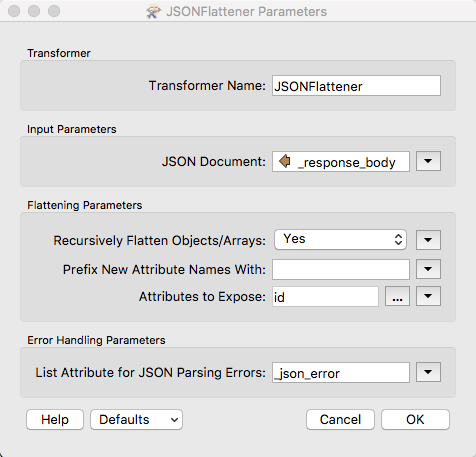

### 4.5 Using REST API Commands in a Workspace Exercise

<table style="border-spacing: 0px;border-collapse: collapse;font-family:serif">
<tr>
<td width=25% style="vertical-align:middle;background-color:darkorange;border: 2px solid darkorange">
<i class="fa fa-cogs fa-lg fa-pull-left fa-fw" style="color:white;padding-right: 12px;vertical-align:text-top"></i>
Exercise 7 
</td>
<td style="border: 2px solid darkorange;background-color:darkorange;color:white">
Using REST API Commands in a Workspace Exercise
</td>
</tr>

<tr>
<td style="border: 1px solid darkorange; font-weight: bold">Data</td>
<td style="border: 1px solid darkorange">None</td>
</tr>

<tr>
<td style="border: 1px solid darkorange; font-weight: bold">Overall Goal</td>
<td style="border: 1px solid darkorange"> To use the REST API in a workspace </td>
</tr>

<tr>
<td style="border: 1px solid darkorange; font-weight: bold">Demonstrates</td>
<td style="border: 1px solid darkorange">How to use the HTTP Caller to access the FME Server</td>
</tr>
<tr>
<td style="border: 1px solid darkorange; font-weight: bold">Starting Workspace</td>
<td style="border: 1px solid darkorange">None</td>
</tr>
<td style="border: 1px solid darkorange; font-weight: bold">Ending Workspace</td>
<td style="border: 1px solid darkorange">C:\FMEData2018\Workspaces\RESTAPITraining\Chapter4Exercise7.End</td>
</tr>

</table>

A very simple workspace you can create would be one that triggers
multiple workspaces in the FME Server. In this workspace, we are going
to step up a workspace to run asynchronously, wait for a response, if
the response is positive the next workspace will run. So let's begin!

*Image 4.5.5 First Step*

**1) Create a new File in Workbench**

**2) Add a Creator Transformer to the Page**
First, add the creator to the page. Keeping the default is okay, this will just trigger the workspace to run.

**3) Add an HTTPCaller to the Page**
Next, add the HTTPCaller. Use the Request URL to write a submit command. You may use the call below or test it out with another workspace.

In the HTTPCaller, you can use the token, or use the authentication option. Simply, enter your username and password into the user authentication area.

**Please note that all calls in this section will require authorization.**

      POST https://localhost/fmerest/v3/transformations/submit/Samples/austinDownload.fmw
      Headers:
            Accept: application/json
            Authorization: fmetoken token=YOUR TOKEN

      Body: {
        "publishedParameters": [
          {
            "name": "MAXY",
            "value": "42"
          },
          {
            "name": "THEMES",
            "value": [
              "airports",
              "cenart"
            ]
          }
        ],
        "TMDirectives": {
          "rtc": false,
          "ttc": 60,
          "description": "This is my description",
          "tag": "linux",
          "priority": 5,
          "ttl": 60
        },
        "NMDirectives": {
          "directives": [
            {
              "name": "email_to",
              "value": "example@safe.com"
            }
          ],
          "successTopics": [
            "SAMPLE_TOPIC"
          ],
          "failureTopics": []
        }
      }

When you insert the body section of the call find **Upload Body** and
click on the dropdown menu. Click on open text editor and paste the upload body into the call. Next, find the **Content Type** section and specify JSON (application/json). The body should look like this:

*Image 4.5.6 Upload Body*

-   Now you can add the JSONFlattener. The JSONFlattener allows you to
    select a part of the JSON to expose, in our case we should expose
    the id, so we can use it for the next call.

*Image 4.5.7 JSON Flattener Parameters*

Step 2. Get Job Status

*Image 4.5.8 Step 2. **

-   In this section, we are using the response from the previous call to
    determine if the call was successfully run. We will add a
    **HTTPCaller.** In the HTTPCaller, click on the drop-down menu
    next to the Request URL and click open Text Editor. Paste the
    request and for the id double-click on this icon
     from the FME Feature Attributes
    side panel. Your call should look like this:

    GET http://YOURSERVER/fmerest/v3/transformations/jobs/id/@Value(id)

-   Now for the response in the HTTPCaller, we are going to change the
    Response Body Attribute to job\_status. So your HTTPCaller should
    look like this:

*Image 4.5.9 HTTP Caller Parameters*

-   Next, we need another **JSON Flattener** to expose the
    \_http\_status\_code from the job\_status attribute. So, for the
    input parameters under JSON Document, we are going to select
    job\_status. Then under attributes to expose write
    \_http\_status\_code.

*Image 4.5.10 Second JSON Flattener Parameters*

-   Now we are going to add a **Tester** to determine if the workspace
    was successfully run. The tester should be set up like this:

*Image 4.5.11 Tester Parameters*

-   If the HTTP status code is 200 then the call was successful and the
    next workspace will be triggered.

Step 3. New Job is Run

-   Finally, I used a third HTTPCaller to run a new job synchronously.
    To do this I used the same call that is
    [here](#running-a-synchronous-job-with-standard-parameters).

*Image 4.5.12 Final HTTP Caller*

While this is not the most practical example because we are running the
same workspace twice but in two different ways, it demonstrates how FME
can be used. It demonstrates the capabilities of running one workspace
and using the response to determine the next action.
