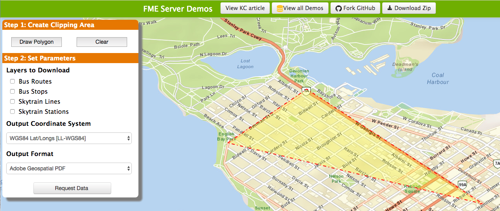

## Using Postman to Recreate the Query made in the Web Application Demonstration

<table style="border-spacing: 0px;border-collapse: collapse;font-family:serif">
<tr>
<td width=25% style="vertical-align:middle;background-color:darkorange;border: 2px solid darkorange">
<i class="fa fa-cogs fa-lg fa-pull-left fa-fw" style="color:white;padding-right: 12px;vertical-align:text-top"></i>
Exercise 8 
</td>
<td style="border: 2px solid darkorange;background-color:darkorange;color:white">
Introduction to using Direct URLs
</td>
</tr>

<tr>
<td style="border: 1px solid darkorange; font-weight: bold">Data</td>
<td style="border: 1px solid darkorange">None</td>
</tr>

<tr>
<td style="border: 1px solid darkorange; font-weight: bold">Overall Goal</td>
<td style="border: 1px solid darkorange"> To use and understand Direct URLs </td>
</tr>

<tr>
<td style="border: 1px solid darkorange; font-weight: bold">Demonstrates</td>
<td style="border: 1px solid darkorange"> How to enter a Direct URL in Postman </td>
</tr>

</table>

At the beginning of the tutorial, we discussed a web application that
allows a user to select an area in Vancouver and receive data back from
the Server with public transit information. We now have all the
necessary information to use the query as a call to the FME Server. The
URL in this example is a direct URL.

### Setting up the Query

1) Visit
     http://demos.fmeserver.com/datadistribution-webmap/index.html?map=arcgis(http://demos.fmeserver.com/datadistribution-webmap/index.html?map=arcgis

2) Click Draw Polygon, and then draw a polygon within the Vancouver
    area. Double click to end your drawing and close your polygon.

*Image 5.1.1 Web Mapping Demo Set Up*

3)   Select the parameters you would like.

4)   Now, copy the query from the from the web application.

*Image 5.1.2 Query Generation*

### Using the Query in Postman

5) Copy the full URL into Postman. This call will not require any
    header or body as all the information needed is in the URL. Set
    the HTTP Verb to GET.

6)   Click send!

*Image 5.1.3 Submitting the Query in Postman*

###  Understanding the Response

7)   This call is pretty advanced so you will receive a big chunk of
    JSON. This JSON would be interpreted by the Web Application and it
    would send back the correct data to the user.

8)   You can explore the headers you receive back from the call. By
    hovering over the bold text Postman provides a description of the
    response header.

The following shows the headers that this call returns.

*Image 5.1.4 Response Headers from Postman*

By hovering over the header it will provide a description of the
response header.

*Image 5.1.5 Response Header Description from Postman*

### Generating Code Snippets

Postman has the ability to generate code snippets from previous
requests. These snippets can be useful when developing your own web
application.

9) On the page where you submitted your request click on the code button by
the cookies.

*Image 5.1.6 Generating Code Snippets in Postman*

There are various languages that Postman can generate, but for this
shows JavaScript.

*Image 5.1.7 Viewing Code Snippets in Postman*
