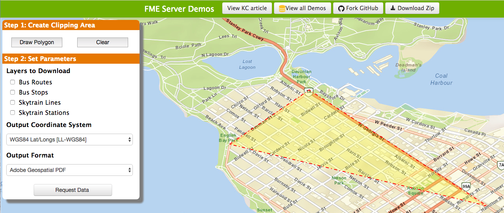
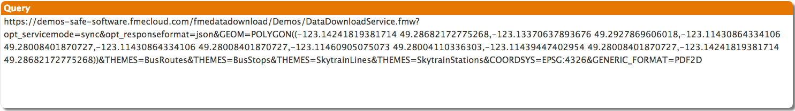

### 6.1 Setting up the Query

-   Visit
     http://demos.fmeserver.com/datadistribution-webmap/index.html?map=arcgis(http://demos.fmeserver.com/datadistribution-webmap/index.html?map=arcgis

-   Click Draw Polygon, and then draw a polygon within the Vancouver
    area. Double click to end your drawing and close your polygon.

*Image 6.1.1 Web Mapping Demo Set Up*

-   Select the parameters you would like.

-   Now copy the query from the from the web application.

*Image 6.1.2 Query Generation*
