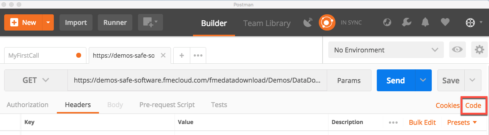

### 6.4 Generating Code Snippets

Postman has the ability to generate code snippets from previous
requests. These snippets can be useful when developing your own web
application.

On the page where you submitted your request click on the code button by
the cookies.

*Image 6.4.1 Generating Code Snippets in Postman*

There are various languages that Postman can generate, but for this
example I used JavaScript.

*Image 6.4.2 Viewing Code Snippets in Postman*
