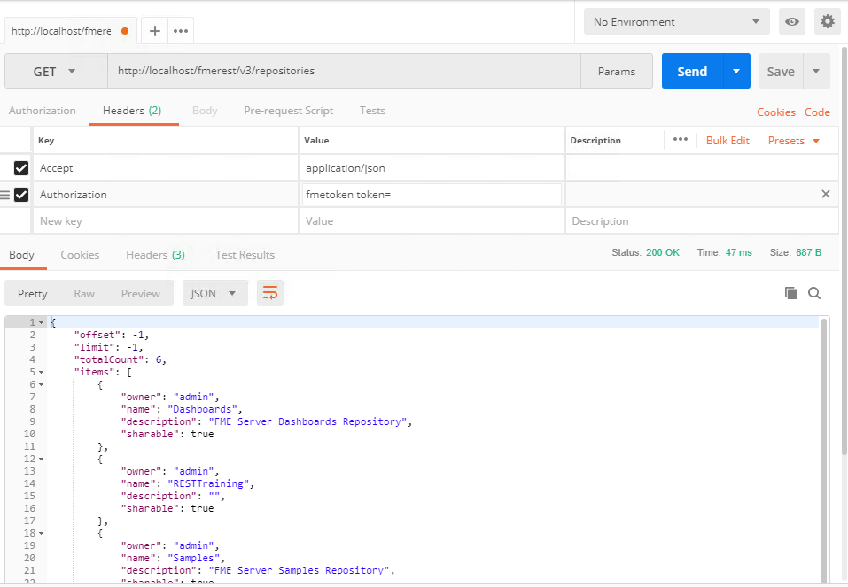
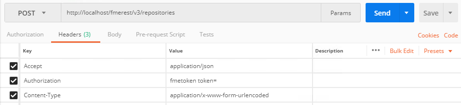
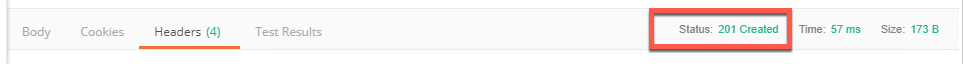
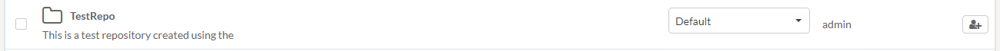
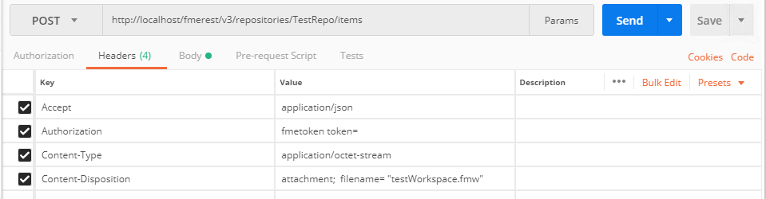
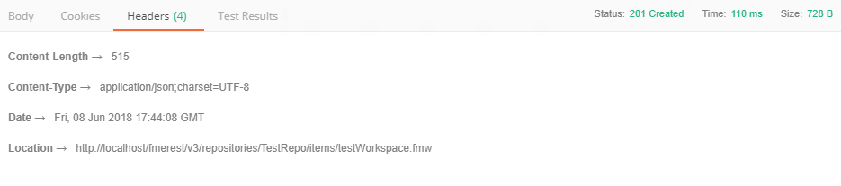
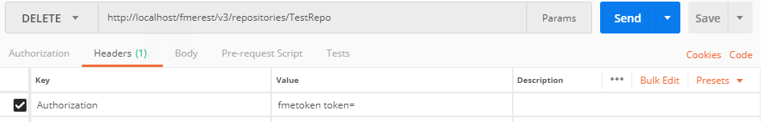
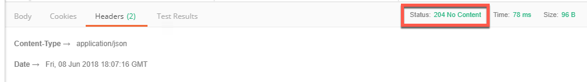
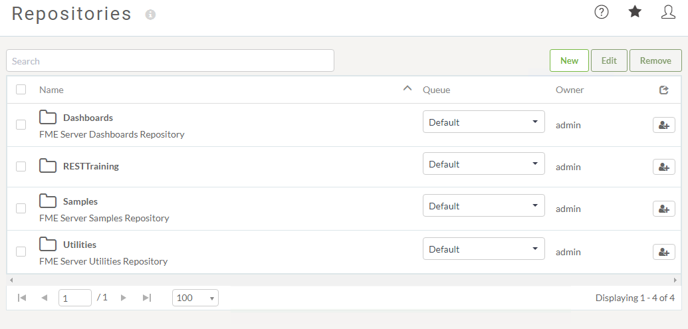

### 6.1 Handling Repositories

<table style="border-spacing: 0px;border-collapse: collapse;font-family:serif">
<tr>
<td width=25% style="vertical-align:middle;background-color:darkorange;border: 2px solid darkorange">
<i class="fa fa-cogs fa-lg fa-pull-left fa-fw" style="color:white;padding-right: 12px;vertical-align:text-top"></i>
Exercise 9 
</td>
<td style="border: 2px solid darkorange;background-color:darkorange;color:white">
Handling Repositories using the REST API
</td>
</tr>

<tr>
<td style="border: 1px solid darkorange; font-weight: bold">Data</td>
<td style="border: 1px solid darkorange">None</td>
</tr>

<tr>
<td style="border: 1px solid darkorange; font-weight: bold">Overall Goal</td>
<td style="border: 1px solid darkorange"> To learn how to list repositories, create repositories, upload a workspace to a repository, and delete the repository. </td>
</tr>

<tr>
<td style="border: 1px solid darkorange; font-weight: bold">Demonstrates</td>
<td style="border: 1px solid darkorange"> The Various Repository calls in the REST API </td>
</tr>
<tr>
<td style="border: 1px solid darkorange; font-weight: bold">Workspace</td>
<td style="border: 1px solid darkorange">C:\FMEData2018\Workspaces\RESTAPITraining\Chapter6Exercise9</td>
</tr>

</table>

This exercise intends to teach the user how to use the REST API to manage repositories.

If you go to, http://localhost/fmerest/apidoc/v3/#!/repositories, you can find all the calls relating to handling repositories.

#### List Repositories

**1) Complete this call to list the repositories in your FME Server using Postman**

    **GET** http://localhost/fmerest/v3/repositories
    Accept: application/json
    Authorization: fmetoken token= [INSERT TOKEN HERE]

This call will list all the repositories in your FME Server.

**2) Review the response**

*Image 6.1.1 List Repositories*

#### Create a Repository

Next, we can can use the REST API to create a repository. This is done by completing the call below.

**3) Enter in the URL and Headers into Postman**

    POST http://localhost/fmerest/v3/repositories
    Accept: application/json
    Content-Type: application/x-www-form-urlencoded
    Authorization: fmetoken token= [INSERT TOKEN HERE]

  
  *Image 6.1.2 Create Repositories URL and Headers*

**4) Switch the Body Tab in Postman**

**5) Click on raw and paste in the following information**

    name=TestRepo&description=This%20is%20a%20test%20repository%20created%20using%20the%20REST%20API

____
**Optional Step**

*Please Note- there is another option to enter in the body. Click x-www-form-urlencoded and fill out the form below:*

*Image 6.1.1 Creating a Repository Using Postman*

Please note, that the keys are case sensitive so if you write "Description" it will not be registered by the API and there will be no description listed.
________

**6) Click Send! Then, review the response in Postman**

There will be no body in the text just the Status 201 Created.

*Image 6.1.4 The Response from Postman*

**7) Check the FME Server to ensure that your repository was created**

*Image 6.1.5 The repository generated from the REST API*

As you can see, the repository was created through the REST API.  

#### Upload a Workspace to a Repository

**8) Enter in the URL and Headers into Postman**

    POST http://localhost/fmerest/v3/repositories/TestRepo/items
    Accept: application/json
    Content-Disposition: attachment; filename= "testWorkspace.fmw"
    Content-Type: application/octet-stream
    Authorization: fmetoken token= [INSERT TOKEN HERE]]

  

  *Image 6.1.5 Upload Workspace Headers and URL*

**9) Switch to the body tab in Postman**

**10) Click on Binary and choose a file**

**UPDATE WITH PROPER PATHWAY**

Find Chapter6Exercise9 under workspaces and select it!

**11)Click send! Then, review the response from Postman**

*Image 6.1.6 Upload Workspace Response*

**12) Review the Workspace that was just uploaded**

If you review the workspace that was just uploaded you can see that it was not registered under any service. So while, it can be run successfully through a REST API command, it will not run through the web interface. We can use another command to register the workspace under a service.

#### Register the Workspace Under a Service

#### Delete a Repository

Now, that we have built a repository with a workspace we can delete it!

**12) Enter the URL and Headers in Postman**

    DELETE http://localhost/fmerest/v3/repositories/TestRepo
    Authorization: fmetoken token= [INSERT TOKEN HERE]

  

  *Image 6.1.7 Delete the Repository*

**13) Click Send! Then, review the response in Postman**

*Image 6.1.8 The Response from the Server*

**14) Go to your FME Server and check that the Repository was deleted**

*Image 6.1.9 The repository was successfully deleted!*
