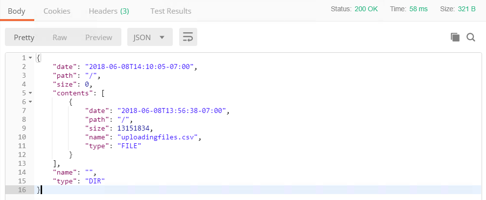

### 6.2 Working with Resources

<table style="border-spacing: 0px;border-collapse: collapse;font-family:serif">
<tr>
<td width=25% style="vertical-align:middle;background-color:darkorange;border: 2px solid darkorange">
<i class="fa fa-cogs fa-lg fa-pull-left fa-fw" style="color:white;padding-right: 12px;vertical-align:text-top"></i>
Exercise 10 
</td>
<td style="border: 2px solid darkorange;background-color:darkorange;color:white">
 Working with Resources
</td>
</tr>

<tr>
<td style="border: 1px solid darkorange; font-weight: bold">Data</td>
<td style="border: 1px solid darkorange">C:\FMEData2018\Data\CellSignals\CellSignal.csv
</td>
</tr>

<tr>
<td style="border: 1px solid darkorange; font-weight: bold">Overall Goal</td>
<td style="border: 1px solid darkorange"> To demonstrate how to upload a file and download a file using the REST API. </td>
</tr>

<tr>
<td style="border: 1px solid darkorange; font-weight: bold">Demonstrates</td>
<td style="border: 1px solid darkorange"> The calls for managing resources </td>
</tr>

</table>

Through the REST API, you will have access to the Resources available in
the FME Server. You can list files, upload files, and delete files all
using the REST API. This is helpful in a web application if you would
like to direct data to a certain area in the FME Server.

#### Uploading a File

This call will upload a file to the data folder in your resources
folder. The filename is specified in the Content-Disposition parameter.
If you wanted to specify a directory in the data folder simply write the
folder name after filesys.

** 1) Enter the following URL and Headers into Postman  **

    POST http://localhost/fmerest/v3/resources/connections/FME_SHAREDRESOURCE_DATA/filesys/
    Content-Type: application/octect-stream
    Accept: application/json
    Content-Disposition: attachment; filename= “uploadingfiles.csv”
    Authorization: fmetoken token= [INSERT TOKEN HERE]

  
    *Image 6.2.1 File Upload Request*

** 2) Switch to the Body Tab in Postman**

** 3) Select Binary and Click Choose Files**
 
Find
C:\FMEData2018\Data\CellSignals\CellSignal.csv as the file to upload!

  *Image 6.2.2 File to Upload*

** 4) Click Send! Then, review the response. **

  *Image 6.2.3 The successful file upload response!*

______________

Optional Query String Parameters

<table>

<tr>
<th>Parameter</th>
<th>Value</th>
<th>Description</th>

</tr>

<tr>
<td>createDirectories</td>
<td> True | **false** </td>
<td>Create directories in the path if they do not exist</td>

<tr>
<td>overwrite</td>
<td>True | **false**</td>
<td> Overwrite the file if it already exists </td>

</tr>

</table>

_________________________________

#### Listing Files

This call will list the files in a resource

** 4) Enter in the Following URL and Headers in Postman**

    GET http://localhost/fmerest/v3/resources/connections/FME_SHAREDRESOURCE_DATA/filesys/
    Accept: application/json
    Authorization: fmetoken token= [INSERT TOKEN HERE]

** 5) View the Response in Postman**

  *Image 6.2.4 Here you can view the file that was successfully uploaded!*

#### Downloading File

This call downloads a file from a resource connection either as an
inline resource or as an attachment. The 'disposition' parameter is
only relevant for some REST clients. In particular, Internet Explorer
behaves poorly without an attachment disposition header. This web page
will only display the response body instead of downloading the file, so
REST clients should inspect the Content-Disposition header and handle
the download.

This call will look into the Resources/Data directory to find uploadingfiles.csv.

**6) Enter in the Following URL and Headers in Postman**

    POST http://localhost/fmerest/v3/resources/connections/FME_SHAREDRESOURCE_DATA/download/uploadingfiles.csv

    Accept: application/octet-stream
    Authorization: fmetoken token= [INSERT TOKEN HERE]
    Content-Type: application/x-www-form-urlendcoded

  
  *Image 6.2.5 File Download Request*

**7) Click the body tab**

**8) Check raw, then paste the content below**

    accept=contents&disposition=inline

**9) Hit Send! Then, review the response in Postman**

*Image 6.2.5 Review the CSV in Postman*

**Parameters**

<table>

<tr>
<th>Parameter</th>
<th>Value</th>
<th>Description</th>

</tr>

<tr>
<td>disposition</td>
<td> inline/attachment </td>
<td>Inline will display the Specifies how to retrieve the resource using the 'Content-Disposition' header. This parameter is only relevant for some REST clients (primarily web browsers). If no disposition is selected, then a header is not set.</td>

<tr>
<td>Path</td>
<td></td>
<td> Path, relative to the resource connection (for example, uploading.csv) </td>

<tr>
<td>Resource</td>
<td></td>
<td>Name of a resource connection. Can contain only alphanumeric characters. (for example, FME_SHAREDRESOURCE_DATA) </td>

</tr>

</table>
