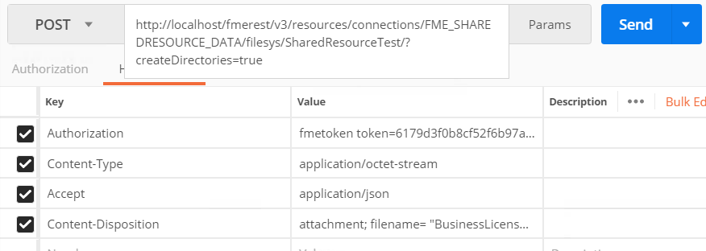
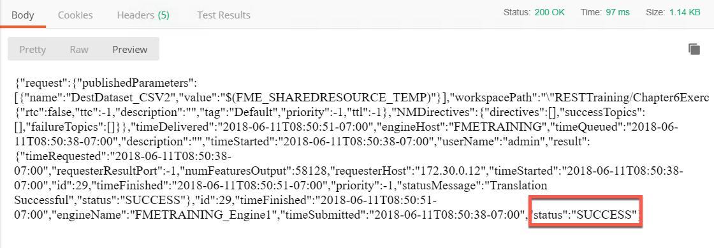

### 6.2 Working with Shared Resources

<table style="border-spacing: 0px;border-collapse: collapse;font-family:serif">
<tr>
<td width=25% style="vertical-align:middle;background-color:darkorange;border: 2px solid darkorange">
<i class="fa fa-cogs fa-lg fa-pull-left fa-fw" style="color:white;padding-right: 12px;vertical-align:text-top"></i>
Exercise 10 
</td>
<td style="border: 2px solid darkorange;background-color:darkorange;color:white">
 Using a Shared Resource as a Workspace Output Location
</td>
</tr>

<tr>
<td style="border: 1px solid darkorange; font-weight: bold">Data</td>
<td style="border: 1px solid darkorange">C:\FMEData2018\Data\Planning\BusinessLicenses.xlsx</td>
</tr>

<tr>
<td style="border: 1px solid darkorange; font-weight: bold">Overall Goal</td>
<td style="border: 1px solid darkorange"> To demonstrate how to upload a file and download a file using the REST API. </td>
</tr>

<tr>
<td style="border: 1px solid darkorange; font-weight: bold">Demonstrates</td>
<td style="border: 1px solid darkorange"> The calls for managing resources </td>
</tr>
<tr>
<td style="border: 1px solid darkorange; font-weight: bold">Workspace</td>
<td style="border: 1px solid darkorange"> C:\FMEData2018\Workspaces\RESTAPITraining\Chapter6Exercise11 </td>
</tr>

</table>

If you wish to retrieve the result dataset from a workspace through the
REST API, the best method is to write it to a shared resource location
that is accessible to the client. In this example we will make a
workspace, then run a call while changing the output to the Temporary
Repository. We will use a very basic workspace to test this out.

#### Create the Workspace

**1)  Open FME Workbench and start a blank workspace.**

**2) Add a Microsoft Excel reader, with the BusinessLicenses File.**

**3) Then add CSV writer to the workspace.**

It is okay to accept the default parameters.

*Image 6.3.1 Excel to CSV Workspace*

**4) Set the Destination Folder.**

The next step is to identify the Published parameter of the destination dataset. It should be called DestDataset_CSV2. Under this parameter, set the destination to be, $(FME_SHAREDRESOURCE_TEMP)

**5) Set the Source Dataset**

We will upload the data using the API later. For now change the source dataset folder to:

    $(FME_SHAREDRESOURCE_DATA)/SharedResourceTest/BusinessLicenses.xlsx

**6) Set the Source Dataset to a Private Parameter**

**7) Click the Publish to FME Server Button**

**8) Select the FME Server Connection created previously. Click Next.**

**9) Set the Repository name to RESTTraining. Click Next.**

**10) Select the Job Submitter Service and publish the Workspace**

#### Upload the Data Using the Resources call

** 11) Enter the following URL and Headers into Postman  **

    POST http://localhost/fmerest/v3/resources/connections/FME_SHAREDRESOURCE_DATA/filesys/SharedResourceTest?createDirectories=true
    Content-Type: application/octect-stream
    Accept: application/json
    Content-Disposition: attachment; filename= “BusinessLicenses.xlsx”
    Authorization: fmetoken token= [INSERT TOKEN HERE]

  
    *Image 6.3.2 File Upload Request*

** 12) Switch to the Body Tab in Postman**

** 13) Select Binary and Click Choose Files**
 
Find
C:\FMEData2018\Data\Planning\BusinessLicenses.xlsx as the file to upload!

**14) Click Send! Then, review the response.**

  *Image 6.3.3 File Upload Response*

#### Run the Job

**15) Enter the following URL and Headers into Postman.**

**Request**

    POST
    http://localhost/fmerest/v3/transformations/submit/RESTAPITraining/Chapter6Exercise11.fmw
    Accept: application/json
    Content-Type: application/json
    Authorization: fmetoken token= YOUR TOKEN

  
      *Image 6.3.4 Submit URLs and Headers*

**16) Switch to the body tab in Postman.**

**17) Click the raw. Then, paste the following information.**

    {
    "publishedParameters": [
    {
      "name": "DestDataset_CSV2",
      "value": "$(FME_SHAREDRESOURCE_TEMP)"
    }
    ]
    }

  
    *Image 6.3.5 Submit Body*

**18) Review the Response from the FME Server**

    {

    "id": 29

    }

*Image 6.3.6 Submit Result*

Please Note. The job ID that is returned by the Server will be different based on how many jobs the FME Server has completed.

#### Test the Job was Successful

**19) Enter the Following call into Postman. Then, Click Send!**

This call will run asynchronously so in return you will receive an id.
To check that your call has been completed, use this call.

***Replace 29 with the ID you received from the last call***

    GET http://localhost/fmerest/v3/transformations/jobs/id/29
    Accept: application/json
    Authorization: fmetoken token= YOUR TOKEN

**20) Review the Response to ensure the job was completed successfully**

*Image 6.3.7 Submit Result*

#### Download the Resulting File

**21) Enter in the Request URL and Headers into Postman**

Then you can download the file using the call below.

     POST http://localhost/fmerest/v3/resources/connections/FME_SHAREDRESOURCE_TEMP/download/Business_Licences.csv

    Accept: application/octet-stream
    Authorization: fmetoken token= YOUR TOKEN
    Content-Type: application/x-www-form-urlendcoded

  
  *Image 6.3.8 The Connection Call Headers and Body*

**22) Switch to the body tab in Postman.**

**23) Click the raw. Then, paste the following information. Click Send!**

    accept=contents&disposition=inline

**24 Review the Response in Postman!**

While Postman can process the call the CSV file cannot be downloaded.

*Image 6.3.9 The Connection Response*
