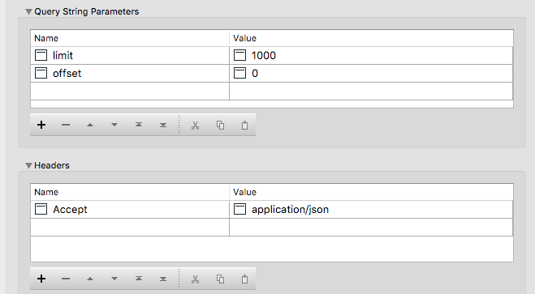
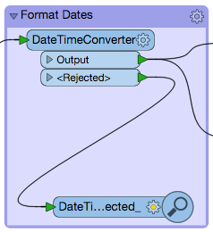
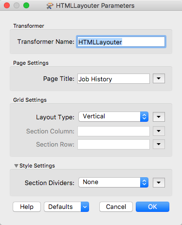

### 7.3 Creating a Workspace to Retrieve Job History Results

<table style="border-spacing: 0px;border-collapse: collapse;font-family:serif">
<tr>
<td width=25% style="vertical-align:middle;background-color:darkorange;border: 2px solid darkorange">
<i class="fa fa-cogs fa-lg fa-pull-left fa-fw" style="color:white;padding-right: 12px;vertical-align:text-top"></i>
Exercise 12 
</td>
<td style="border: 2px solid darkorange;background-color:darkorange;color:white">
 Create a Workspace to Retrieve Job History Results
</td>
</tr>

<tr>
<td style="border: 1px solid darkorange; font-weight: bold">Data</td>
<td style="border: 1px solid darkorange">None</td>
</tr>

<tr>
<td style="border: 1px solid darkorange; font-weight: bold">Overall Goal</td>
<td style="border: 1px solid darkorange"> To Create a Workspace that can retrieve the last 1000 jobs and display it in an HTML. </td>
</tr>

<tr>
<td style="border: 1px solid darkorange; font-weight: bold">Demonstrates</td>
<td style="border: 1px solid darkorange"> How to use the Get Jobs call in a workspace </td>
</tr>
<tr>
<td style="border: 1px solid darkorange; font-weight: bold">Workspace</td>
<td style="border: 1px solid darkorange"> C:\FMEData2018\Resources\RESTAPI\Chapter7Exercise13.Complete</td>
</tr>

</table>

For this exercise, we are going to create a workspace that retrieves the
job history from your FME Server and creates an HTML file with the
results. The first workspace we will create retrieves the latest 1000
jobs from the FME Server. Then the results are formatted into a table
with the results and beneath this, there will be a chart with the number
of results by date.

#### Use the HTTPCaller to Get Jobs and then Format the Attributes

*Image 7.3.1- Initial Setup*

**1) Add a Creator**

As with the previous exercise, we will start with the Creator. It is okay to leave the defaults for this.

**2) Add the HTTPCaller**

 Add the HTTPCaller and set the parameters as listed below:

        Request URL: http://<yourServerHost>/fmerest/v3/transformations/jobs/completed
        HTTP Method: GET

*Image 7.3.2 HTTPCaller Parameters*

*Image 7.3.3 HTTPCaller Authentication*

**3) Attach an Inspector**

If you attach an Inspector at this point, you can see the entire response with all the jobs is stored in the response body attribute. If you open double click on the response body to examine it you will see:

*Image 7.3.4 HTTPCaller Response*

We need to parse the response to get the information we want into attributes we can use. For this exercise, we are going to keep the id, timeSubmitted, and status.

**4) Delete the Inspector**

**5) Add a JSONFragmenter**

We are going to use the JSONFragmenter to parse the needed attributes into the needed attributes.

*Image 7.3.5 JSONFragmenter Parameters*

The JSON Attribute is the response body which is produced from the
    previous call

For the JSON Query, we want to find all the responses in the items
    category therefore, we use this statement json\["items"\]\[\*\]

Next, we need to set up the Flattening Parameters in the
    JSONFragmenter.

*Image 7.3.6 Flattening Parameters*

Here, we enter the attributes we would like to keep from the query.
    You should keep the id, timeSubmitted, and status.

**6) Add an Attribute Keeper**

Next, add the AttributeKeeper. Under parameters and Attributes to Keep: write timeSubmitted, id, status.

*Image 7.3.7 Attribute Keeper Parameters*

#### Format Dates

*Image 7.3.8- Format the Dates Provided From the FME Server*

**7) Add the DateTimeConverter**

Use the DateTimeConverter to format the dates into the appropriate format.

*Image 7.3.9 DateTime Converter*

#### Create a Table with the Job History Results

*Image 7.3.10- Step 3*

If we compiled a table with the result currently, it would create a
    table however, it would not have an order so we use the Sorter
    transformer.

**8) Add the Sorter transformer**

The Sorter transformer will be connected to the DateTimeConverter. Under the Sort By section list the following parameters:

*Image 7.3.11- Sorter Parameters*

**9) Add the HTMLReportGenerator**

In the HTML Report Generator, we can add custom HTML or a table with information gained from the FMEServer.  

*Image 7.3.12- HTML Report Generator Parameters*

**10) Add Custom HTML to the HTMLReportGenerator**

 First, we want to add Custom HTML to specify the header on our HTML file.

    <h2><strong>Monthly Server Report</strong></h2>

-   If you had an introduction or any formatting, you could place it
    here as well.

**11) Add a table to the HTMLReportGenerator**

Next, under page contents, we would add a Table. Here, you may
    specify the column contents and headings the table will use.

*Image 7.3.13- HTML Report Generator Table Parameters*

To view the table before it is created, click the Preview in Browser
    button.

#### Create a Bar Chart with Jobs by Date

*Image 7.3.14- Step 4*

**12) Add the Aggregator transformer**

Add the Aggregator transformer and attach it to the DateTimeConverter.

We need to aggregate all jobs by date to create the bar chart so we need the Aggregator.

*Image 7.3.15- Aggregator Parameters*

Here, we are grouping the results by timeSubmitted which is the date
    the attributes were submitted. Then under Count Attribute, we
    create a new Attribute named DateCount.

**13) Attach the HTMLReportGenerator**

Next, we attach another HTMLReportGenerator. The parameters are set up below:

*Image 7.3.16- HTML Report Generator Chart Parameters*

#### Format the Layout and Write to HTML

*Image 7.3.17- Format the Layout and Write to HTML*

**14) Add the HTMLLayouter**

Attach both the HTMLReportGenerators to the HTMLLayouter.

*Image 7.3.18- HTML Layouter Parameters*

**15) Add an HTML Writer**

Finally, we add an HTML Writer.

**16) View the results!**

Run the workspace and view the results.

*Image 7.3.19- Results*
