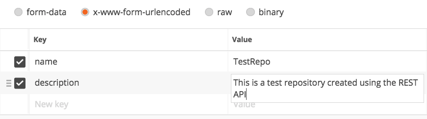

### 7.1 Handling Repositories

**Listing Repositories**

    **GET** https://YOURSERVER/fmerest/v3/repositories
    Accept: application/json

**Creating a New Repository**

    POST https://YOURSERVER/fmerest/v3/repositories
    Accept: application/json
    Content-Type: application/x-www-form-urlencoded

    name=TestRepo&description=This%20is%20a%20test%20repository%20created%20using%20the%20REST%20API

This uploads a new repository called TestRepo. There are two ways to
enter the body in Postman. The first is to select the raw option and
copy and paste the body as it is in the call above. The other option is
to select x-www-form-urlencoded and fill out the form below:

*Image 7.1.1 Creating a Repository Using Postman*

Please note that the keys are case sensitive so if you write
"Description" it will not be registered by the API and there will be no
description listed.

**Upload a Workspace to a Repository**

    POST https://YOURSERVER/fmerest/v3/repositories/TestRepo/items
    Accept: application/json
    Content-Disposition: attachment; filename=\"testWorkspace.fmw\"
    Content-Type: application/octet-stream

    (workspace data)

To use this call, you will need to upload the workspace in the body of
the call. To use this in Postman click on the body tab, then binary and
choose the workspace you will like to upload.

**Deleting a Repository**

    DELETE https://YOURSERVER/fmerest/v3/repositories/TestRepo
