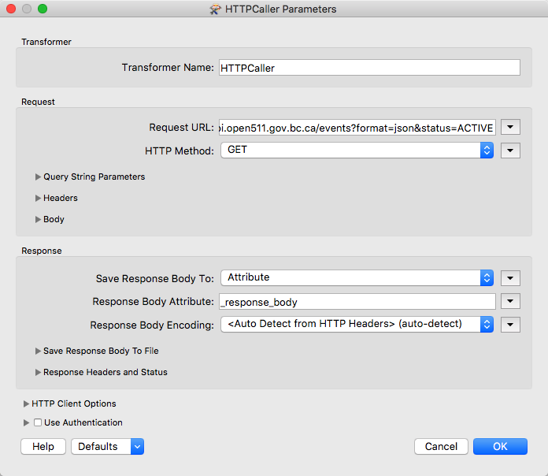
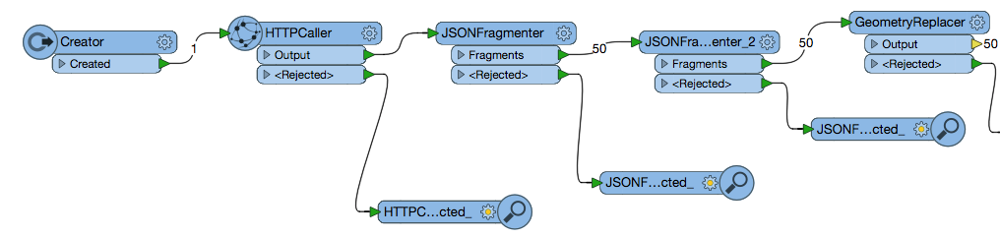
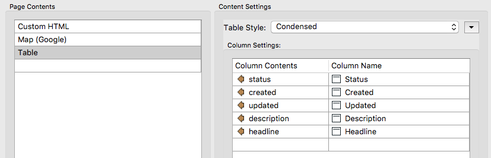

### 9.1 Creating a Web Page with Current Road Conditions

1)  **Add the Creator**

Add the Creator transformer to begin the workflow. Using the default
settings is fine.

2)  **Add the HTTPCaller**

Next, we need to add the HTTPCaller to contact the Drive BC API. The
Drive BC API is open to the public so no authorization or authentication
is needed. Under Request URL put:

    http://api.open511.gov.bc.ca/events?format=json&status=ACTIVE

The HTTP Method is GET

The HTTPCaller Parameters should look like this:

*Image 9.1.1 HTTPCaller Parameters*

Currently, the workspace should look like this:

*Image 9.1.2 Creator and HTTP Caller*

3)  **Add JSONFragmenter**

The response body will be returned as a long section of JSON. We need to
break this down and expose the attributes needed. All the important
information is stored in the category of events so to gain access to it
under the JSON Query write:

    json\["events"\]\[\*\]

*Image 9.1.3 JSON Fragmenter Parameters*

Now we can flatten the JSON to produce the attributes needed for the
table. In the Attributes to Expose Section list status, headline,
description, created, and updated.

The Flattening Parameters should look like this:

*Image 9.1.4 JSON Flattening Parameters*

4)  **Add another JSONFragmenter**

Now we need to expose the Geography component to create features.

*Image 9.1.5 Second JSON Fragmenter Parameters*

There are no Flattening Parameters in this transformer.

5)  **Add a GeometryReplacer**

The GeometeryReplacer is an amazing transformer. It can read the JSON
from the Response Body and will automatically create the geometry
associated with it.

*Image 9.1.6 Geometry Replacer Parameters*

Currently, the workspace should look like this:

*Image 9.1.7 Workspace Overview*

6)  **CoordinateSystemSetter**

Now we need to set the coordinate system used. The coordinate system is
referenced in URL returned by the call. So we can set it to LL-WGS84
\[EPSG \#4326\].

7)  **HTMLReportGenerator**

Now we are ready to create a webpage with the following information. We
need three sections, a title, a map, and a table.

The title is made with custom HTML

    <h1> Drive BC Road and Weather Conditions </h1>

*Image 9.1.8 Custom HTML*

Next, you may add a Map Component. For this exercise, I used Google with
an API Key. I labeled the attribute with the description of the
condition.

*Image 9.1.9 Google Map*

Next, I created a table with the status, created, updated, description,
and headline columns.

*Image 9.1.10 Table*

8)  **HTML Writer**

Finally, add in the HTML writer to write to a file of your choice.

With no additional formatting, this is the final product.

*Image 9.1.11 Finished Product*

Each icon is clickable and will produce the description of the
condition.

**Data Attribution:**

BC Roads
