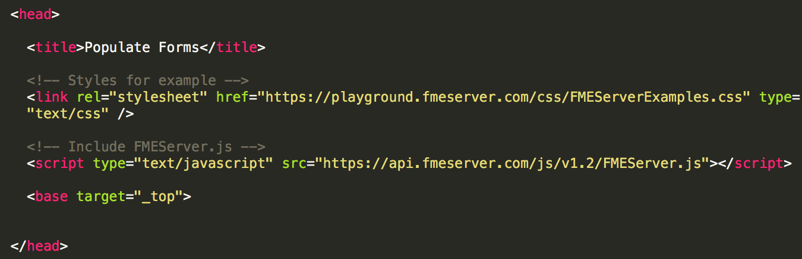
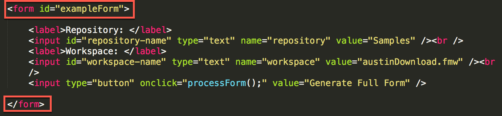
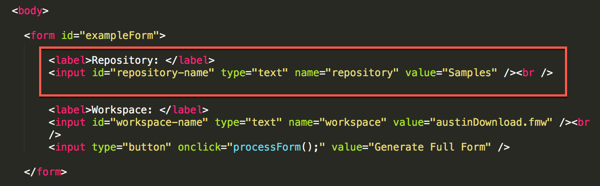
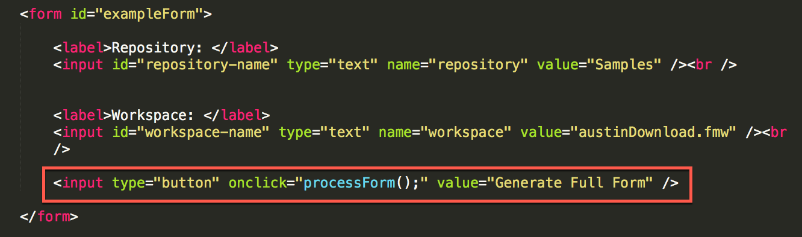
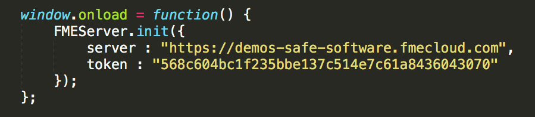
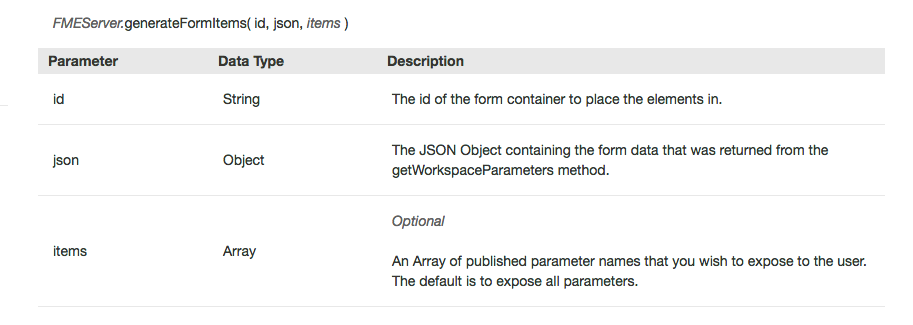
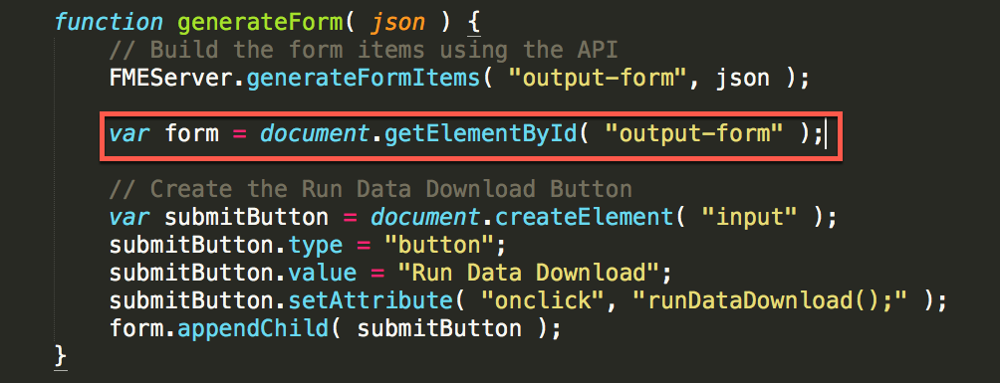
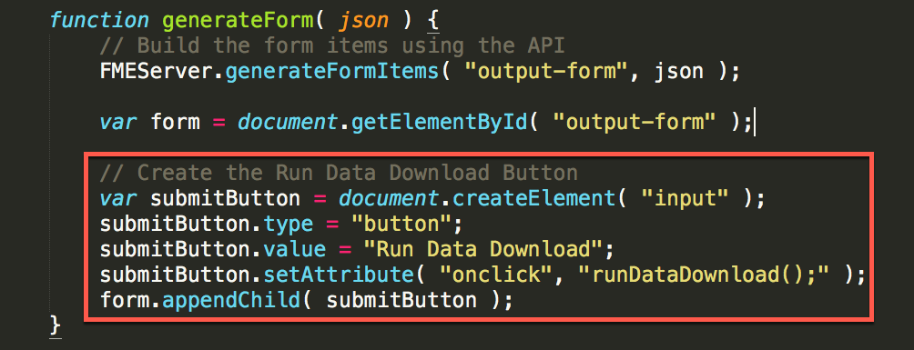
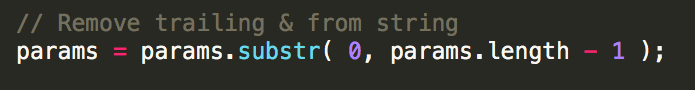
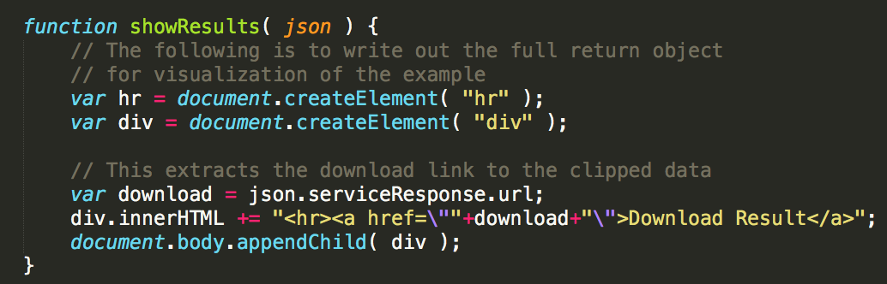

<table style="border-spacing: 0px;border-collapse: collapse;font-family:serif">
<tr>
<td width=25% style="vertical-align:middle;background-color:darkorange;border: 2px solid darkorange">
<i class="fa fa-cogs fa-lg fa-pull-left fa-fw" style="color:white;padding-right: 12px;vertical-align:text-top"></i>
<span style="color:white;font-size:x-large;font-weight: bold">Exercise 14</span>
</td>
<td style="border: 2pxJavaScriptkorange;background-color:darkorange;color:white">
<span style="color:white;font-size:x-large;font-weight: bold"> Dynamically Generate a Form Using the REST API </span>
</td>
</tr>

<tr>
<td style="border: 1px solid darkorange; font-weight: bold">Data</td>
<td style="border: 1px solid darkorange">None</td>
</tr>

<tr>
<td style="border: 1px solid darkorange; font-weight: bold">Overall Goal</td>
<td style="border: 1px solid darkorange"> To display the capabilities of FMEs JavaScript API. This exercise allows you to dynamically generate a form based on the parameters in a  workspace and have a user fill in the parameters and run the workspace.  </td>
</tr>

<tr>
<td style="border: 1px solid darkorange; font-weight: bold">Demonstrates</td>
<td style="border: 1px solid darkorange"> How to use getWorkspaceParameters, generateFormItems, and runDataDownload functions. </td>
</tr>

</table>

#### Create the Form

***1) Open Notepad++***

***2) Save a blank file as myFirstApp.html***

Navigate to the C:/FMEData2018/Resources/RESTAPI and save the file as myFirstApp.html.

***3) Copy and Paste the following code:***

    <head>

      <title>Populate Forms</title>

      <!-- Styles for example -->
      <link rel="stylesheet" href="https://playground.fmeserver.com/css/FMEServerExamples.css" type="text/css" />

      <!-- Include FMEServer.js -->
      <script type="text/JavaScript" src="https://api.fmeserver.com/js/v1.2/FMEServer.js"></script>

      <base target="_top">


    </head>


_9.1.1. The Head Section of the HTML_

In the head section of the page, we link to the external stylesheet and  
the FME JavaScript Library.

Next, we will build the body of the HTML. We need to create a form that  
will display the initial information needed to find the workspace.

***4) In the body section paste:***

```
<body>

    <form id="exampleForm">
        <label>Repository: </label>
        <input id="repository-name" type="text" name="repository" value="Samples"/><br />
        <label>Workspace: </label>
        <input id="workspace-name" type="text" name="workspace" value="austinDownload.fmw" /> <br />
        <input type="button" onclick="processForm();" value="Generate Full Form" />
    </form>


</body>
```



_9.1.2. The Example Form_

These two areas indicate that we have created a form that is referred to  
as "exampleForm". If we needed the JavaScript to act upon the form this  
is how we will refer to it by the id.



_9.1.3. The form items are created_

In the form we create a label and an input. The label is entitled  
Repository: which will appear on the page. Then we need to give the  
input an id so it can be called upon later. The input type is text, the  
name is repository, and default value will be Samples.

We repeat the same input process for the workspace.



_9.1.4. A button is created for the form_


***5) Paste this code inside the body section***

Now, we need an area to put the new form after it has been created. So we  
have to create a blank form that will be modified by the JavaScript. This  
will be inserted **inside the body** after the first form.

```
<hr />

 <form id="output-form"></form>
```

In this section, we will create the button which will be processed to  
create the form with the parameters.

***6) Test the code!***

First, let's test out our page! You can test your page by clicking on the HTML file. You should see this.


_9.1.5. The final form_

#### Add the JavaScript to Populate the Form

Currently, we have a page with no functionality. So let's add in some  
JavaScript.

***7) Add the JavaScript tags to the code***

Within the body, we can add the script tag. This indicates that the next  
section is in JavaScript. **All the JavaScript will be within these  
tags.**

```
  <script type="text/JavaScript">

  </script>
```

***8) Add the following code within the JavaScript tags***

First, we have to connect to the FME Server to retrieve the information  
for the repository and the workspace.

```

window.onload = function() {
            FMEServer.init({
                server : "http://52.xx.xx.xxx",
                token : "568c604bc1f235bbe137c514e7c61a8436043070"
            });
        };


```



_9.1.6. Connect to the Server_

***9) Look up your public IP address***

Google "my ip address". The first result should be a display from Google with your public IP address.

***10) Update the server and token to yours***

***11) Insert the code below***

Next, we can insert the function processForm. This is activated when the  
user clicks on the Generate Full Form button.

```
// The process form function that gets the repository and the workspace
            function processForm() {
            var repository = document.getElementById( "repository-name" ).value;
            var workspace = document.getElementById( "workspace-name" ).value;

            // Get the workspace parameters from FME Server
            FMEServer.getWorkspaceParameters( repository, workspace, generateForm );
        }
```


_9.1.7. Repository and Workspace are assigned_

In this section we are creating variables from the inputs we received  
from the previous form.


_9.1.8. Get Workspace Parameters_

Then we use the function FMEServer.getWorkspaceParameters to get the  
workspace parameters created in the call.


_9.1.9. Workspace Parameters Information_

***12) Paste this section below the ProcessForm function.***

```
function generateForm( json ) {

            // Build the form items using the API
            FMEServer.generateFormItems( "output-form", json );
}
```

This function has the following parameters:



_9.1.10. Generate Form Items Information_

The id is the "output-form" which is the id of a blank form created.

***13) Test the Script***

Time to test the script. Once you click, generate full form the output  
produced should be:


_9.1.11. Final Output_


#### Add the Javascript to Run the Data Download

***14) Add the following code to the generateForm function***

The next step is to add the script needed to process the form.

To do this we need to add in the following code in the ***generate form*** function:

```
var form = document.getElementById( "output-form" );
// Create the Run Data Download Button
var submitButton = document.createElement( "input" );
submitButton.type = "button";
submitButton.value = "Run Data Download";
submitButton.setAttribute( "onclick", "runDataDownload();" );
form.appendChild( submitButton );
```



_9.1.12. Get the output form variable_

In this section, we are creating a variable from the existing blank output form.



_9.1.13. Create the Data Download Button_

***15) Add the following code***

In this section we are creating a button that once clicked will run the Data Download.

    function showResults( json ) {
      // The following is to write out the full return object
      // for visualization of the example
      var hr = document.createElement( "hr" );
      var div = document.createElement( "div" );

      // This extracts the download link to the clipped data
      var download = json.serviceResponse.url;
      div.innerHTML += "<hr><a href=\""+download+"\">Download Result</a>";
      document.body.appendChild( div );
    }

    function runDataDownload() {
      var repository = document.getElementById( "repository-name" ).value;
      var workspace = document.getElementById( "workspace-name" ).value;
      var form = document.getElementById( "output-form" );
      var params = "";

      // Loop through unique parameters and build the parameter string
      for( var i = 0; i < form.length; i++ ){
        var element = form.elements[i];
        if( element.type == "select" ) {
          params += element.name+"="+element[element.selectedIndex].value+"&";
        } else if( element.type == "checkbox" ){
          if( element.checked ) {
            params += element.name+"="+element.value+"&";
          }
        } else {
          params += element.name+"="+element.value+"&";
        }
      }

      // Remove trailing & from string
      params = params.substr( 0, params.length - 1 );

      // Use the FME Server Data Download Service
      FMEServer.runDataDownload( repository, workspace, params, showResults );
    }

The next two functions read the parameters and run the data download.


_9.1.14. Get the Variables from the first form_

In this section we are getting the variables that have been collected  
from the first form. We are also creating a blank variable for that will hold the parameters.


_9.1.15. Loop through the parameters_

In this section we are looping through the parameters to find their name  
and value. We are doing this because the parameters have to be written  
in this format for this function to work.

```
Any workspace specific parameter values must be written as a string with this format:
name1=value1&name2=value2 etc\...
```

After the params has been complied there will be an additional ampersand  
\(&\) at the end of the string. This is removed by the following  
statement,



_9.1.16. Remove the trailing ampersand_


Finally, we can use the runDataDownload function.


_9.1.17. Run the Data Download Function_


_9.1.18. Data Download Information_

We named the callback showResults so we can create the showResults  
function which will contain the return.



_9.1.19. Show Results_

***16) Test the final product***  

Test the App again and it should be completed!
